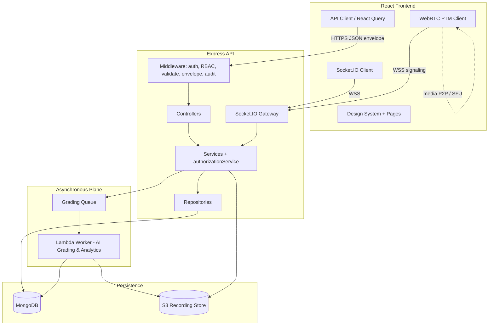
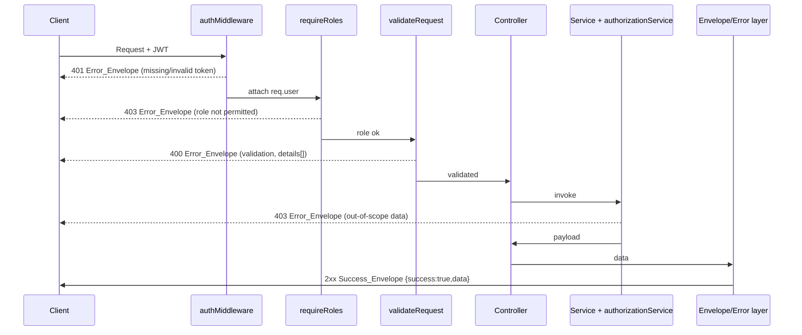

# Design Document

## Overview

This design describes a four-phase overhaul of the Gurukul AI Portal — an existing TypeScript/Express + Mongoose backend and a React/MUI/Vite frontend connected by a REST API and a Socket.IO real-time channel. The overhaul hardens the API surface and access model (Phase 1), redesigns the user experience (Phase 2), deepens AI-assisted assessment (Phase 3), and adds secure real-time communication and WebRTC video conferencing (Phase 4).

The guiding principle is **incremental, backwards-compatible delivery**: every phase must leave the Portal fully operational and pass the existing automated test suite. The design therefore favours additive and refactoring changes over rewrites, reuses the existing building blocks already present in the repository, and standardises cross-cutting concerns (response shape, access control, audit) once in Phase 1 so later phases inherit them for free.

The design is grounded in the current codebase:

- **Backend** (`backend/src`): layered as `routes → controllers → services → repositories → models (Mongoose)`, with middleware for auth (`authMiddleware`), role checks (`rbacMiddleware.requireRoles`), validation (`validateRequest`), error handling (`errorHandler.AppError`), sanitisation, and performance monitoring. An `authorizationService` already enforces data-level isolation. Async grading exists via `jobs/gradingQueue` + `jobs/gradingWorker` and the `GradingJob` model. Real-time messaging primitives exist under `realtime/` (`socketManager`, `messageHandler`, `messagingRbac`).
- **Frontend** (`src`): React with MUI, a `design-system/` package exposing tokens and `createGurkulTheme`, `theme/createEnhancedTheme`, route definitions in `app/routes.tsx`, providers including `SocketProvider`, and per-role feature folders under `features/`.
- **Tooling**: backend tests run on Jest (with `mongodb-memory-server`), frontend tests on Vitest; `fast-check` is already a dependency on both sides and is used for existing property tests.

### Phase Summary

| Phase | Theme | Priority | Primary Surface |
|-------|-------|----------|-----------------|
| 1 | Architecture Audit & API Refactoring | Foundational | Backend API, RBAC, audit, seed |
| 2 | UI/UX Redesign | Foundational | Frontend design system, responsive, a11y, admin tables |
| 3 | AI Integration for Assessment & Grading | Advanced | Assessment model, AI grader, async jobs, analytics |
| 4 | Communication & PTM Video | Advanced | Socket.IO channels, scheduling, WebRTC, S3 recordings |

## Architecture

### Current vs. Target (high level)



### Architectural Decisions

1. **Standardise the response envelope in one middleware layer (Phase 1).** Rather than editing every controller, a response-shaping helper plus a finalising step in `errorHandler` guarantees every success returns `{ success, data }` and every error returns `{ success, message, details? }`. This is the smallest change that satisfies Requirement 2 across all namespaces and is inherited by all later phases (Requirement 20.2).

   - *Decision note:* the existing `types/api.ts` defines `ApiSuccessResponse<T>` as `{ data, meta }` and `ApiErrorResponse` as `{ error, message, details }` — neither carries the `success` discriminator the requirements mandate. The design introduces a new canonical `ResponseEnvelope` type and adapts controllers/serialisers to it, keeping the `meta` pagination affordance nested inside `data` or alongside it.

2. **Two-layer access control retained and formalised (Requirement 4, 22).** Route-level `requireRoles` (coarse role gate) plus service-level `authorizationService` (fine-grained data isolation) are kept. Admin override paths additionally emit an `AuditLog` entry. This "defence in depth" already exists and is extended rather than replaced.

3. **Route Map as generated artifact (Requirement 1, 3).** The canonical Route_Map is produced by introspecting the Express router stack at startup and reconciling it against the existing Swagger definitions (`config/swagger.ts`). Generating it from the live router (rather than maintaining a hand-written list) makes drift detectable and supports the compliance check in 1.3 and duplicate detection in 3.1/3.2.

4. **Async-first AI workloads (Phase 3, Requirement 14, 23).** Submission enqueues a `GradingJob` and returns immediately; a Lambda_Worker performs grading off the request path. The existing `gradingQueue`/`gradingWorker` and `GradingJob` model are the foundation; the design adds Assessment/Submission models and a job-status read path.

5. **Real-time over Socket.IO; media over WebRTC (Phase 4).** Messaging and PTM signaling reuse the existing Socket.IO gateway with a role-constrained namespace/room model. Media flows peer-to-peer (or via a configured SFU/TURN) and never through the Express request path. Recordings land in S3 with time-limited signed URLs.

6. **Backwards compatibility as a gate (Requirement 20).** Each phase ends with the full existing suite green and existing user journeys intact. Contract changes preserve the envelope and externally observable behaviour unless a requirement explicitly overrides it.

### Request Lifecycle (Phase 1 target)



## Components and Interfaces

### Phase 1 — Architecture Audit & API Refactoring

**Route Map Generator** (`backend/src/utils/routeMap.ts`)
- `buildRouteMap(app): RouteMapEntry[]` — walks the registered Express router stack and returns one entry per `{method, path}`.
- `RouteMapEntry = { method, path, namespace, requiredRole, requestSchemaRef?, responseSchemaRef? }`.
- `findDuplicateRoutes(entries): RouteMapEntry[][]` — groups entries that resolve to the same resource action (Requirement 3.1/3.2).
- `findMissingDocs(entries, swaggerPaths): RouteMapEntry[]` — entries present in the router but absent from documentation (Requirement 1.3).
- Namespaces covered: attendance, auth, course, enrollment, faculty, grading, health, mark, metrics, parentMe, studentMe, student (Requirement 1.4).

**Response Envelope Layer** (`backend/src/utils/envelope.ts` + `middleware/errorHandler.ts`)
- `success<T>(data: T, meta?): SuccessEnvelope<T>` → `{ success: true, data, ...(meta && { meta }) }`.
- `failure(message, details?): ErrorEnvelope` → `{ success: false, message, ...(details && { details }) }`.
- `errorHandler` maps `AppError` (and unknown errors) to an `ErrorEnvelope` with the correct status (401/403/400/404/409/500). Validation errors (`validateRequest`) populate `details[]` with `{ field, reason }` (Requirement 2.4).

**RBAC & Authorization** (existing `middleware/rbacMiddleware.ts`, `services/authorizationService.ts`)
- `requireRoles(...roles)` — coarse gate; 401 when no `req.user`, 403 when role not allowed.
- `authorizationService.assert*Access(...)` — fine-grained isolation for student/parent/teacher; admin bypasses (Requirement 4.2–4.6).
- **Admin override + audit**: override service methods wrap the mutation and call `auditService.record({ actor, action, target, timestamp })` (Requirement 4.9, 22.3).

**Audit Service** (existing `services/auditService.ts`, model `models/AuditLog.ts`)
- `record(entry: AuditEntry): Promise<void>` — persists actor, action, target record reference, and timestamp.

**Seed Routine** (`backend/scripts/seedAllUsers.js` extended)
- Idempotent upserts keyed by stable natural keys (e.g., email) so re-runs do not duplicate (Requirement 6.5).
- Produces a connected graph: Admin/Teacher/Student/Parent accounts, courses, enrollments, marks, attendance, messages, metrics, with Parent→Student and Student→Course links (Requirement 6.1–6.4).

### Phase 2 — UI/UX Redesign

**Design System** (`src/design-system/`)
- Existing barrel exports tokens (`colors`, `spacing`, `typography`, `elevation`, `borderRadius`) and `createGurkulTheme`/`lightTheme`/`darkTheme`.
- Add/normalise reusable components: `Button`, `Card`, `Table`/`DataTable`, `Form` controls, `Modal`, `Navigation` (Requirement 7.1). All consume tokens; no one-off styles (Requirement 7.2/7.3).

**DataTable** (`src/design-system/components/DataTable.tsx`)
- Props: `columns`, `rows`, `sort`, `onSortChange`, `filters`, `onFilterChange`, `page`, `pageSize`, `total`, `onPageChange`, `onRowSelect`.
- Pure presentation over server- or client-provided data; supports column sort, filter predicate, pagination, and row drill-down callback (Requirement 10).

**Responsive Layout** (`src/components/layout/`)
- Breakpoint-driven layout; collapsible navigation at ≤768px (Requirement 8.3); no horizontal scroll 320–2560px (Requirement 8.1).

**Accessibility utilities** (`src/utils/accessibilityHelpers.js`)
- Focus-visible styles, ARIA roles/labels, alt-text conventions, contrast-checked token pairs (Requirement 9).

**Admin Dashboard** (`src/pages/AdminDashboard.tsx`, `src/features/admin/`)
- Live metrics from metrics Endpoints (Requirement 11.1); override controls calling override Endpoints with optimistic-safe error display (Requirement 11.2–11.4).

### Phase 3 — AI Assessment & Grading

**Assessment Service** (`backend/src/services/assessmentService.ts`, new)
- `createAssessment(teacherId, dto)` → persists Assessment + questions, associates Course (Requirement 12.1/12.2).
- `submitAnswers(studentId, assessmentId, answers)` → validates submission window; persists submission or rejects after close (Requirement 12.3/12.4).

**Grading Pipeline** (existing `jobs/gradingQueue.ts`, `jobs/gradingWorker.ts`, `services/gradingService.ts`)
- On submission with subjective answers → `enqueue(GradingJob)` and return immediately (Requirement 13.1, 14.1).
- Lambda_Worker performs NLP evaluation, returns `{ score, maxScore, confidence, explanation }` per answer (Requirement 13.2).
- Job status machine: `queued → processing → (completed | failed)` (Requirement 14.3). `getJobStatus(jobId)` returns current status and result reference when completed (Requirement 14.4).
- Teacher override of AI score/feedback before finalisation (Requirement 13.4). Failure → mark job failed + notify teacher (Requirement 13.5).

**Analytics Engine** (`backend/src/services/analyticsService.ts`, new; offloaded to Lambda for heavy compute)
- `computeStudentTrend(studentId)` when sufficient graded data exists (Requirement 15.1).
- `courseAnalytics(courseId, teacherId)` aggregates across the teacher's enrolled students (Requirement 15.2).
- `predictiveInsight(studentId)` → indicator + confidence (Requirement 15.3). Access constrained to authorised teachers, the student, and linked parents (Requirement 15.4).

### Phase 4 — Communication & PTM Video

**Messaging Gateway** (existing `realtime/socketManager.ts`, `messageHandler.ts`, `messagingRbac.ts`)
- Channel types: Parent↔Teacher, Teacher↔Student, Teacher↔Admin (Requirement 16.1).
- `canJoin(user, channel)` / `canPost(user, channel)` enforce role constraints; violations → 403 Error_Envelope (Requirement 16.3).
- Real-time delivery to authorised participants (Requirement 16.2); persist every message (Requirement 16.4); queue undelivered messages for offline recipients and flush on reconnect (Requirement 16.5).

**PTM Scheduling Service** (`backend/src/services/ptmService.ts`, new)
- `schedule(organizer, dto)` persists meeting (participants, date, time) and notifies invitees (Requirement 17.1/17.2).
- Conflict detection: overlapping PTM for the same Teacher → reject with conflict Error_Envelope (Requirement 17.3).
- Join authorisation: only PTM parties may join (Requirement 17.4).

**Video Service** (`src/services` WebRTC client + `realtime/` signaling)
- WebRTC offer/answer/ICE relayed over Socket.IO signaling; connection established at/after start time (Requirement 18.1).
- Audio/video transmit while active (18.2); reconnect on drop (18.3); release media on leave (18.4).

**Recording** (`backend/src/services/recordingService.ts`, new + S3)
- When enabled, capture session → store in `Recording_Store` (S3) (Requirement 19.1); associate reference with PTM (19.2).
- `getRecordingUrl(ptmId, user)` → time-limited signed URL for authorised participants (19.3); unauthorised → 403 (19.4).

## Data Models

Existing models reused: `Student`, `Parent`, `Faculty`, `Course`, `Enrollment`, `Mark`, `Attendance`, `AuditLog`, `GradingJob`, `Message`, `RefreshToken`.

### Response Envelope (shared type)

```typescript
type SuccessEnvelope<T> = { success: true; data: T; meta?: { page?: number; limit?: number; total?: number } };
type ErrorEnvelope = { success: false; message: string; details?: Array<{ field: string; reason: string }> };
type ResponseEnvelope<T> = SuccessEnvelope<T> | ErrorEnvelope;
```

### AuditLog (existing)

```typescript
interface AuditLogEntry { actor: ObjectId; action: string; targetType: string; targetId: ObjectId; timestamp: Date; metadata?: object; }
```

### Assessment & Submission (new — Phase 3)

```typescript
interface IQuestion { questionId: string; prompt: string; type: 'objective' | 'subjective'; maxScore: number; options?: string[]; answerKey?: string; }
interface IAssessment { _id: ObjectId; courseId: ObjectId; teacherId: ObjectId; title: string; questions: IQuestion[]; opensAt: Date; closesAt: Date; createdAt: Date; updatedAt: Date; }

interface IAnswer { questionId: string; response: string; }
interface IGradedAnswer { questionId: string; score: number; maxScore: number; confidence?: number; feedback?: string; overriddenByTeacher: boolean; }
interface ISubmission {
  _id: ObjectId; assessmentId: ObjectId; studentId: ObjectId;
  answers: IAnswer[]; submittedAt: Date;
  gradingJobId?: ObjectId;
  gradingStatus: 'queued' | 'processing' | 'completed' | 'failed';
  gradedAnswers?: IGradedAnswer[]; finalized: boolean;
}
```

### Analytics (new — Phase 3, computed/cached)

```typescript
interface IStudentTrend { studentId: ObjectId; metrics: { period: string; average: number }[]; computedAt: Date; }
interface IPredictiveInsight { studentId: ObjectId; indicator: 'improving' | 'steady' | 'at_risk'; confidence: number; computedAt: Date; }
```

### PTM & Recording (new — Phase 4)

```typescript
interface IPTM {
  _id: ObjectId; teacherId: ObjectId; parentId: ObjectId; studentId: ObjectId;
  scheduledStart: Date; scheduledEnd: Date;
  status: 'scheduled' | 'active' | 'completed' | 'cancelled';
  participants: ObjectId[]; recordingEnabled: boolean; recordingRef?: string;
}
interface IRecordingRef { ptmId: ObjectId; s3Key: string; createdAt: Date; }
```

### Channel (Phase 4 — derived/constrained)

```typescript
type ChannelType = 'parent_teacher' | 'teacher_student' | 'teacher_admin';
interface IChannelMembership { channelType: ChannelType; participantRoles: [UserRole, UserRole]; }
```

## Correctness Properties

*A property is a characteristic or behavior that should hold true across all valid executions of a system — essentially, a formal statement about what the system should do. Properties serve as the bridge between human-readable specifications and machine-verifiable correctness guarantees.*

These properties cover the input-varying logic of this feature: response shaping, route-map generation, access-control decisions, seed idempotence, data-table operations, submission-window enforcement, AI grading bounds, job state, analytics bounds, messaging channel constraints, persistence round-trips, PTM conflict detection, and queue ordering. UI rendering, WebRTC media, performance targets, transport encryption, and infrastructure scaling are validated by example/integration/smoke tests instead (see Testing Strategy).

### Property 1: Route map completeness and compliance

*For any* set of registered API routes, the generated Route_Map SHALL contain exactly one complete entry (method, path, namespace, required role, request/response schema references) for every registered route, and the set of routes missing from documentation SHALL be empty for a compliant API.

**Validates: Requirements 1.1, 1.2, 1.3**

### Property 2: Route uniqueness (no duplicates)

*For any* generated Route_Map, no two entries SHALL share the same resource-action and HTTP method combination.

**Validates: Requirements 3.1, 3.2**

### Property 3: Success envelope shape

*For any* successful endpoint outcome with payload `p`, the response SHALL equal `{ success: true, data: p }` (optionally carrying `meta`), and this SHALL hold across all resource namespaces.

**Validates: Requirements 2.1, 2.5, 20.2**

### Property 4: Error envelope shape

*For any* error outcome, the response SHALL equal `{ success: false, message: <string>, details?: <object> }` and SHALL hold across all resource namespaces.

**Validates: Requirements 2.2, 2.5**

### Property 5: Status code consistency

*For any* handled outcome, the HTTP status SHALL be in the 2xx class when the envelope's `success` is `true` and in the 4xx or 5xx class when `success` is `false`.

**Validates: Requirements 2.3**

### Property 6: Validation errors populate field-level details

*For any* request that fails input validation or contains disallowed content, the API SHALL respond with status 400 and an Error_Envelope whose `details` lists an entry for each failing field.

**Validates: Requirements 2.4, 22.5**

### Property 7: Authentication required for protected endpoints

*For any* protected endpoint, a request lacking a valid (present, non-expired, well-formed) JWT access token SHALL be denied with an Error_Envelope and HTTP status 401.

**Validates: Requirements 4.1, 4.8, 22.1**

### Property 8: Data-scope isolation

*For any* authenticated non-admin user (Teacher, Student, or Parent) and any record, the request SHALL succeed only if the record lies within the user's authorized scope (Teacher: owned/assigned courses and their students/marks/attendance; Student: own records; Parent: linked students' records, including analytics); otherwise it SHALL be denied with an Error_Envelope and HTTP status 403.

**Validates: Requirements 4.4, 4.5, 4.6, 4.7, 15.4, 22.2**

### Property 9: Admin full access

*For any* module, an authenticated Admin SHALL be granted read access, and an Admin override SHALL be permitted to modify records in that module.

**Validates: Requirements 4.2, 4.3**

### Property 10: Admin override is audited

*For any* Admin override that modifies a record, the API SHALL persist exactly one AuditLog entry recording the actor, action, target record, and timestamp.

**Validates: Requirements 4.9, 22.3**

### Property 11: Seed idempotence

*For any* database already containing Seed_Data, re-running the seed routine SHALL leave every collection's record count unchanged (no duplicates created).

**Validates: Requirements 6.5**

### Property 12: Seed relational integrity

*For any* seeding run against an empty database, every created Parent SHALL be linked to at least one Student and every created Student SHALL be linked to at least one Course.

**Validates: Requirements 6.3**

### Property 13: Data table sort ordering

*For any* dataset and any sortable column, the sorted output SHALL be a permutation of the input rows ordered (ascending or descending) by that column's values.

**Validates: Requirements 10.1**

### Property 14: Data table filter soundness

*For any* dataset and any filter criteria, every row in the filtered output SHALL satisfy the filter predicate.

**Validates: Requirements 10.2**

### Property 15: Data table pagination integrity

*For any* dataset and page size `N`, each page SHALL contain at most `N` rows, and the disjoint union of all pages SHALL equal the full dataset with no row duplicated or omitted.

**Validates: Requirements 10.3**

### Property 16: Submission window enforcement

*For any* Assessment submission, the submission SHALL be accepted and persisted with a Success_Envelope if and only if its submission time falls within `[opensAt, closesAt]`; otherwise it SHALL be rejected with an Error_Envelope.

**Validates: Requirements 12.3, 12.4**

### Property 17: Assessment persistence round-trip

*For any* created Assessment, loading it back SHALL yield equivalent questions and the same Course association.

**Validates: Requirements 12.1**

### Property 18: Subjective submission enqueues a grading job

*For any* submission containing at least one subjective answer, exactly one Grading_Job SHALL be enqueued, and the submission response SHALL be returned without waiting for grading to complete.

**Validates: Requirements 13.1, 14.1**

### Property 19: Graded answer bounds and persistence

*For any* AI-graded answer, the produced score SHALL satisfy `0 <= score <= maxScore` with non-empty textual feedback, and upon job completion these scores and feedback SHALL be persisted against the submission.

**Validates: Requirements 13.2, 13.3**

### Property 20: Grading failure handling

*For any* Grading_Job whose evaluation fails, the job status SHALL become `failed` and a notification to the owning Teacher SHALL be produced.

**Validates: Requirements 13.5**

### Property 21: Grading job status validity

*For any* Grading_Job at any point in its lifecycle, its status SHALL be one of `queued`, `processing`, `completed`, or `failed`, and a status query for a completed job SHALL return a result reference.

**Validates: Requirements 14.3, 14.4**

### Property 22: Predictive insight bounds

*For any* predictive insight, the confidence value SHALL satisfy `0 <= confidence <= 1` and the indicator SHALL be one of the allowed categories.

**Validates: Requirements 15.3**

### Property 23: Analytics aggregation correctness

*For any* Course dataset, the aggregated performance pattern presented to a Teacher SHALL equal the aggregate computed over that Teacher's enrolled Students, and a per-Student trend SHALL be produced whenever sufficient graded data exists.

**Validates: Requirements 15.1, 15.2**

### Property 24: Messaging channel role constraint

*For any* user and any Channel, joining or posting SHALL be permitted if and only if the user's role is a member of that Channel's permitted role pair; otherwise the action SHALL be denied with an Error_Envelope and HTTP status 403.

**Validates: Requirements 16.1, 16.3**

### Property 25: Message persistence round-trip

*For any* message sent on a Channel, the message SHALL be retrievable from that conversation's history with identical content.

**Validates: Requirements 16.4**

### Property 26: Offline message retain-and-deliver

*For any* message sent to an offline recipient, the message SHALL be retained and delivered exactly once when that recipient reconnects.

**Validates: Requirements 16.5**

### Property 27: PTM persistence round-trip

*For any* validly scheduled PTM, loading it back SHALL yield equivalent participants, date, and time.

**Validates: Requirements 17.1**

### Property 28: PTM conflict detection

*For any* existing PTM and any new PTM request for the same Teacher, the new request SHALL be rejected with a conflict Error_Envelope if and only if their time ranges overlap.

**Validates: Requirements 17.3**

### Property 29: PTM and recording authorization

*For any* user who is not a party to a PTM, both joining the meeting and requesting its recording SHALL be denied with an Error_Envelope and HTTP status 403.

**Validates: Requirements 17.4, 19.4**

### Property 30: Recording association

*For any* stored PTM recording, the recording reference SHALL resolve to the correct originating PTM.

**Validates: Requirements 19.2**

### Property 31: Grading queue order preservation

*For any* sequence of enqueued Grading_Jobs, the jobs SHALL be processed in enqueue order with no enqueued job dropped.

**Validates: Requirements 23.2**

## Error Handling

All errors converge on the standardized Error_Envelope through the existing `errorHandler` middleware and `AppError` factory.

- **AppError taxonomy**: `unauthorized` (401), `forbidden` (403), `badRequest`/validation (400), `notFound` (404), `conflict` (409, e.g., PTM overlap), and a catch-all `internal` (500). Each maps to an Error_Envelope with an appropriate `message`.
- **Validation**: `validateRequest` collects field-level failures and surfaces them in `details[]` as `{ field, reason }` (Requirement 2.4, 22.5). Disallowed content is rejected with 400.
- **Authorization failures**: route-level `requireRoles` produces 403; `authorizationService.assert*` produces 403 for out-of-scope data; missing/invalid tokens produce 401 (Requirements 4.7, 4.8).
- **Async grading failures**: a failed Lambda evaluation marks the `GradingJob` (and affected submission) as `failed`, records a failure reason, and triggers a Teacher notification rather than throwing on the request path (Requirement 13.5). Transient failures use the existing retry/`retryCount` affordance before being marked failed.
- **Real-time failures**: unauthorized channel actions emit a 403-equivalent error event to the offending socket without disrupting other participants (Requirement 16.3). Undelivered messages for offline recipients are persisted and queued for redelivery (Requirement 16.5).
- **WebRTC failures**: dropped connections trigger reconnection attempts; signaling errors are surfaced to the client without crashing the session (Requirement 18.3).
- **Recording access failures**: unauthorized recording requests return 403; expired signed URLs require re-request (Requirements 19.3, 19.4).
- **Idempotent recovery**: the seed routine and job processing are safe to re-run; partial failures do not create duplicates (Requirements 6.5, 23.2).
- **Backwards compatibility**: error contracts preserve the envelope shape across phases so existing clients continue to parse failures uniformly (Requirement 20.2).

## Testing Strategy

A dual approach combines property-based tests (universal correctness) with example/integration/smoke tests (specific behaviors, infrastructure, and UI).

### Property-Based Testing

- **Library**: `fast-check`, already a dependency. Backend property tests run under Jest with `mongodb-memory-server` (matching `baseRepository.property.test.ts`); frontend property tests run under Vitest (matching `gradeCalculation.property.test.ts`).
- **Iterations**: each property test runs a minimum of 100 generated cases (`fc.assert(..., { numRuns: 100 })` or higher).
- **Do not** hand-roll generators where fast-check arbitraries suffice; do not implement PBT from scratch.
- **Traceability**: every property test is tagged with a comment referencing its design property, in the form:
  `// Feature: admin-portal-overhaul, Property {number}: {property text}`
- **Coverage mapping**: Properties 1–31 above are each implemented by a single property-based test. Suggested placement:
  - Properties 1–2 (route map): `backend/src/utils/routeMap.property.test.ts`
  - Properties 3–6 (envelopes/validation): `backend/src/utils/envelope.property.test.ts`
  - Properties 7–10 (auth/isolation/admin/audit): `backend/src/services/authorization.property.test.ts`
  - Properties 11–12 (seed): `backend/scripts/seed.property.test.ts`
  - Properties 13–15 (data table): `src/design-system/components/DataTable.property.test.tsx`
  - Properties 16–23 (assessment/grading/analytics): `backend/src/services/assessment.property.test.ts`, `grading.property.test.ts`, `analytics.property.test.ts`
  - Properties 24–26 (messaging): `backend/src/realtime/messaging.property.test.ts`
  - Properties 27–30 (PTM/recording): `backend/src/services/ptm.property.test.ts`
  - Property 31 (queue order): `backend/src/jobs/gradingQueue.property.test.ts`

### Example-Based Unit Tests

- Route namespace coverage (1.4), placeholder removal (5.1, 5.2), seed account creation (6.1, 6.2), design-system token derivation (7.2, 7.3), breakpoint/mobile-nav behavior (8.2, 8.3), subjective free-text affordance (12.2), teacher override workflow (13.4), override controls presence (11.2), channel type definitions (16.1), PTM notification dispatch (17.2), row drill-down (10.4), override-failure display (11.4).

### Integration Tests (1–3 representative examples each)

- Live-data rendering of visible routes (5.3, 11.1, 11.3), seeded multi-role login journeys (6.4), real-time message delivery between connected sockets (16.2), WebRTC signaling/transmit/reconnect/release (18.1–18.4), S3 recording capture and signed-URL access (19.1, 19.3), Lambda separation of grading workload (14.2), and backwards-compatibility regression of existing journeys per phase (20.1, 20.3, 20.4).

### Accessibility & Visual Tests

- `axe-core` checks for contrast, labels/roles, and alt text (9.1, 9.3, 9.4); keyboard navigation tests (9.2); Playwright viewport sweep 320–2560px for no horizontal scroll and responsive layout (8.1). The existing `tests/visual-regression/` and `.storybook` setup back these.

### Performance & Smoke Tests

- k6 load tests (existing `load-tests/`) assert p95 latencies for read endpoints (21.1), AI-action acknowledgement (21.2), data-table paging (21.3), and message delivery (21.4), plus concurrent-PTM capacity (23.3).
- Smoke/config checks for TLS on messaging/video/recording transport (22.4), dead-code/reachability via lint (3.3), route-map regeneration in CI (3.4), design-system component availability (7.1), and Lambda/S3 elasticity configuration (23.1, 23.4).

### Full Accessibility Note

Full WCAG 2.1 AA conformance cannot be proven by automated tooling alone; automated checks (axe-core, contrast, keyboard) are complemented by manual assistive-technology testing and expert review before each foundational phase is considered complete.
