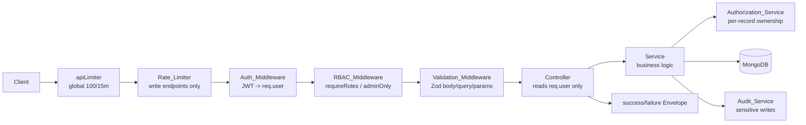
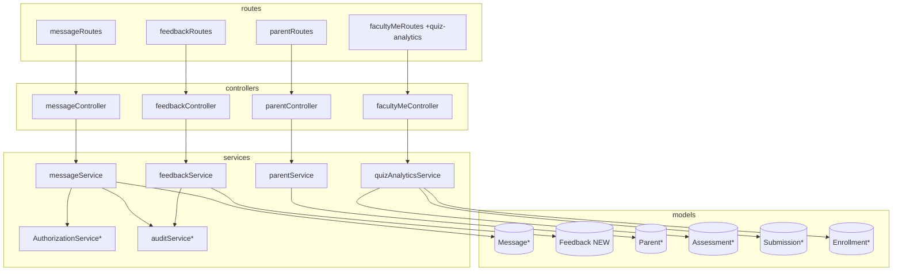

# Design Document

## Overview

This feature adds four backend capability areas to the Gurukul AI platform that the existing React frontend already expects: **Messaging**, **Feedback**, an **Admin Parents List**, and **Faculty Quiz Analytics**. Every new endpoint is implemented as a thin Express route → controller → service slice that reuses the platform's established request pipeline, the canonical response `Envelope`, per-endpoint rate limiting, `AuthorizationService` ownership checks, and `auditService` for sensitive actions.

The design follows the existing codebase conventions exactly:

- **Routing**: one router file per resource namespace under `src/routes`, exported through `src/routes/index.ts` and mounted in `src/server.ts`.
- **Pipeline**: `authMiddleware` → `requireRoles`/`adminOnly` → `validateRequest` (Zod) → controller → service → `AuthorizationService`.
- **Controllers**: HTTP-thin. They read identity from `req.user` only (never client-supplied identifiers), delegate to a service, wrap the result with `success()` from `utils/envelope.ts`, and forward errors to the global error handler via `next(error)`.
- **Services**: HTTP-agnostic business logic that throws `AppError` for failures and returns plain DTOs.
- **Audit**: write endpoints build an `AuditContext` via `auditContextFrom(req)` and pass it to the service, which calls `auditService.logEvent(...)` with metadata passed through `redactSecrets(...)`.

Three areas reuse existing infrastructure: the `Message` model and its `getUserConversations`/`getConversation` statics already exist; the `validateMessagingPermission` helper in `src/realtime/messagingRbac.ts` already encodes who-may-message-whom; and the `Assessment`/`Submission` models already hold the authoritative quiz data. Only the **Feedback** area introduces a new Mongoose model.

The new messaging REST endpoints **complement** the existing Socket.IO realtime layer rather than replace it: REST serves conversation history and CRUD (list, read thread, send, mark read, delete) while sockets continue to push live updates. The frontend keeps its socket client for live delivery and uses REST for loading and mutations.

### Scope of New Code

| Area | New files | Reused infrastructure |
| --- | --- | --- |
| Messaging | `messageRoutes.ts`, `messageController.ts`, `messageService.ts` | `Message` model, `validateMessagingPermission`, `AuthorizationService` |
| Feedback | `feedbackRoutes.ts`, `feedbackController.ts`, `feedbackService.ts`, `Feedback.ts` model | `auditService`, envelope, rate limiter |
| Admin Parents | `parentRoutes.ts`, `parentController.ts`, `parentService.ts` | `Parent` model, faculty/student list pattern |
| Quiz Analytics | `quizAnalyticsService.ts` + handler on `facultyMeController`/`facultyMeRoutes` | `Assessment`, `Submission`, `Enrollment` models |

## Architecture

### Request pipeline (every new endpoint)



The ordering is significant for several requirements. For the delete-message endpoint (Requirement 5.9) the chain is fixed as `Auth → RBAC → Rate_Limiter → message-existence → ownership`, and the earliest failing condition determines the returned status. For mark-as-read (Requirement 4.3) ownership authorization is evaluated **before** existence, so an unauthorized caller can receive 403 even when the id matches no document. These orderings are realized by where each check sits in the route middleware array and the service method body.

### Module layout



`*` = existing infrastructure reused unchanged (or minimally extended).

### Route mounting in `server.ts`

```ts
app.use('/api/messages', messageRoutes);
app.use('/api/feedback', feedbackRoutes);
// Admin parents list mounted BEFORE the self-service router so GET /api/parents
// resolves to the admin list and never collides with /api/parents/me/* (Req 10.8).
app.use('/api/parents', parentRoutes);
app.use('/api/parents', parentMeRoutes);
// Quiz analytics is a teacher self-scope route added to the existing facultyMe router,
// mounted under /api/faculty (so the path is /api/faculty/me/quiz-analytics).
app.use('/api/faculty', facultyMeRoutes);
```

Because `parentRoutes` only defines `GET /` and `parentMeRoutes` defines `/me/*`, the two never overlap regardless of order; mounting `parentRoutes` first additionally guarantees the list-root precedence the requirement calls for.

## Components and Interfaces

### 1. Messaging API (`/api/messages`)

| Method | Path | Roles | Rate-limited | Requirement |
| --- | --- | --- | --- | --- |
| GET | `/conversations` | teacher, parent | no | 1 |
| GET | `/conversations/:conversationId` | teacher, parent | no | 2 |
| POST | `/` | teacher, parent | yes | 3 |
| PATCH | `/:messageId/read` | teacher, parent | no | 4 |
| DELETE | `/:messageId` | teacher, parent | yes | 5 |

**`messageService`** (HTTP-agnostic):

```ts
interface ConversationSummary {
  conversationId: string;
  latestMessage: MessageDTO;
  unreadCount: number;   // for the authenticated user
  messageCount: number;  // total non-deleted messages
}

interface MessageDTO {
  id: string;
  conversationId: string;
  subject: string;
  content: string;
  senderId: string; senderModel: 'Parent' | 'Faculty'; senderName: string;
  recipientId: string; recipientModel: 'Parent' | 'Faculty'; recipientName: string;
  studentId: string; studentName: string;
  isRead: boolean; readAt?: Date;
  messageType: string; priority: string;
  createdAt: Date;
}

class MessageService {
  listConversations(userId: string, role: UserRole, page: number, limit: number):
    Promise<{ data: ConversationSummary[]; total: number }>;

  getThread(userId: string, role: UserRole, conversationId: string, page: number, limit: number):
    Promise<{ data: MessageDTO[]; total: number; conversationExists: boolean }>;

  send(userId: string, role: UserRole, input: SendMessageInput, ctx: AuditContext):
    Promise<MessageDTO>;

  markRead(userId: string, role: UserRole, messageId: string): Promise<MessageDTO>;

  softDelete(userId: string, role: UserRole, messageId: string, ctx: AuditContext): Promise<void>;
}
```

Scoping rules (all derived from `req.user`):

- **listConversations** filters at the conversation level: only conversations where the user is `senderId` (with matching `senderModel`) or `recipientId` (with matching `recipientModel`), excluding `isDeleted` messages. The role `teacher` maps to `senderModel/recipientModel === 'Faculty'`, `parent` maps to `'Parent'`. This reuses the existing `Message.getUserConversations` aggregation, which already computes `latestMessage`, `unreadCount`, and `messageCount`.
- **getThread** loads non-deleted messages for the `conversationId` ordered by `createdAt` ascending, but first calls `AuthorizationService.assertConversationParticipant` to verify membership before returning any content. A conversation that exists but has only deleted messages returns an empty collection with `meta.conversationExists = true`, distinct from a non-existent conversation (`meta.conversationExists = false`).
- **send** calls `validateMessagingPermission(userId, role, recipientId, recipientModel)` (existing helper) before persisting; a denial throws `AppError.forbidden`. `senderId`/`senderModel`/`senderName` are derived from `req.user` and the looked-up sender record. On success it writes an audit entry.
- **markRead** verifies the user is the recipient (`AuthorizationService.assertMessageRecipient`) **before** existence; idempotent when already read (leaves `readAt` unchanged).
- **softDelete** verifies the message exists (404 if not), then verifies sender-or-recipient ownership, then sets `isDeleted`/`deletedAt` and audits. If the persisted update is not confirmed, it throws rather than returning 200.

### 2. Feedback API (`/api/feedback`)

| Method | Path | Roles | Rate-limited | Requirement |
| --- | --- | --- | --- | --- |
| POST | `/` | student, parent | yes | 6 |
| GET | `/me` | student, parent | no | 7 |
| GET | `/received` | teacher | no | 8 |
| POST | `/:feedbackId/replies` | teacher | yes | 9 |
| POST | `/requests` | teacher | yes | 9 |

`GET /received` returns both the recent feedback collection and `Feedback_Stats` in one response: `{ data: FeedbackDTO[], meta: { page, limit, total, stats } }`.

**`feedbackService`**:

```ts
interface FeedbackStats {
  total: number;
  positive: number;        // rating >= POSITIVE_THRESHOLD
  needsAttention: number;  // rating <= NEEDS_ATTENTION_THRESHOLD
  averageRating: number;   // 0 when total === 0
}

class FeedbackService {
  submit(authorId: string, role: UserRole, input: SubmitFeedbackInput, ctx: AuditContext):
    Promise<FeedbackDTO>;
  listOwn(authorId: string, role: UserRole, page: number, limit: number):
    Promise<{ data: FeedbackDTO[]; total: number }>;
  listReceived(teacherId: string, page: number, limit: number):
    Promise<{ data: FeedbackDTO[]; total: number; stats: FeedbackStats }>;
  reply(teacherId: string, feedbackId: string, message: string, ctx: AuditContext):
    Promise<FeedbackDTO>;
  requestFeedback(teacherId: string, input: RequestFeedbackInput, ctx: AuditContext):
    Promise<FeedbackRequestDTO>;
}
```

Scoping rules: `submit` and `listOwn` derive the author from `req.user`; `listReceived`, `reply`, and `requestFeedback` derive the target/responder from `req.user`. `reply` returns 404 when the feedback id does not exist and 403 (via `AuthorizationService.assertFeedbackTarget`) when the feedback's target is not the authenticated teacher.

### 3. Admin Parents List API (`/api/parents`)

| Method | Path | Roles | Requirement |
| --- | --- | --- | --- |
| GET | `/` | admin | 10 |

`parentService.list(filters, pagination)` mirrors `facultyService.list`: `limit` bounded to 100, optional `search` over `firstName`/`lastName`/`email`/`phoneNumber`/`parentId`, password excluded from every record (the `Parent` schema already marks `password` as `select: false`, and the DTO mapper omits it explicitly as defense-in-depth). The router applies `adminManagementRateLimit` like `facultyRoutes`.

### 4. Quiz Analytics API (`GET /api/faculty/me/quiz-analytics`)

| Method | Path | Roles | Requirement |
| --- | --- | --- | --- |
| GET | `/me/quiz-analytics` | faculty/teacher, admin | 11 |

Added to `facultyMeRoutes`/`facultyMeController`, delegating to a new `quizAnalyticsService`.

```ts
interface QuizAnalytics {
  totalAttempts: number;
  averageScorePercent: number;            // 0 when no finalized graded submissions
  scoreDistribution: Record<string, number>; // bands -> count
  completionStatus: Record<GradingStatus, number>; // queued/processing/completed/failed
  completionRatePercent?: number;         // submissions / enrolled students (assumption-gated)
  passRatePercent?: number;               // finalized scores >= PASS_THRESHOLD (assumption-gated)
  perAssessment: AssessmentAnalytics[];
}

class QuizAnalyticsService {
  compute(teacherId: string): Promise<QuizAnalytics>;
}
```

`compute` first resolves the teacher's `Assessment` ids (`teacherId === req.user.userId`), then computes every metric only from those assessments and their `Submission` documents. An assessment with no submissions contributes zeroed metrics. Metrics whose source data is genuinely absent are omitted rather than fabricated (Requirement 11.8); see Design Decisions.

## Data Models

### Existing models (reused unchanged)

- **Message** (`messages` collection) — used for all of Requirements 1–5. Key fields: `conversationId`, `senderId`/`senderModel`, `recipientId`/`recipientModel`, `studentId`, `isRead`/`readAt`, `isDeleted`/`deletedAt`, timestamps. Existing statics `getUserConversations` and `getConversation` and the instance `markAsRead()` are reused. The schema's `toJSON` transform already strips `isDeleted` and `__v`.
- **Assessment** / **Submission** / **Enrollment** — source of truth for quiz analytics.
- **Parent** (`parents` collection) — source for the admin parents list; `password` is `select: false`.

### New model: `Feedback` (`feedback` collection)

```ts
interface IFeedbackReply {
  responderId: Types.ObjectId;       // Faculty
  responderModel: 'Faculty';
  message: string;                   // <= COMMENT_MAX_LENGTH
  createdAt: Date;
}

interface IFeedback extends Document {
  authorId: Types.ObjectId;          // refPath authorModel
  authorModel: 'Student' | 'Parent';
  authorRole: 'student' | 'parent';
  targetType: 'teacher' | 'course';
  targetId: Types.ObjectId;          // refPath: 'Faculty' when teacher, 'Course' when course
  rating: number;                    // integer within [RATING_MIN, RATING_MAX]
  comment: string;                   // <= COMMENT_MAX_LENGTH
  replies: IFeedbackReply[];
  isDeleted: boolean;
  deletedAt?: Date;
  createdAt: Date;
  updatedAt: Date;
}
```

Indexes:

- `{ targetType: 1, targetId: 1, createdAt: -1 }` — feedback addressed to a teacher/course, recent-first (Requirements 8.1, 8.4).
- `{ authorId: 1, createdAt: -1 }` — a user's own feedback, recent-first (Requirements 7.1, 7.4).

Configuration constants (centralized so the scale is configurable per Requirement 6.2 / Open Question 1):

```ts
const RATING_MIN = 1;
const RATING_MAX = 5;
const POSITIVE_THRESHOLD = 4;        // rating >= 4 counts as positive
const NEEDS_ATTENTION_THRESHOLD = 2; // rating <= 2 counts as needs-attention
const COMMENT_MAX_LENGTH = 2000;     // mirrors Message.content max length
```

`Feedback_Stats` are computed on read (no denormalized counters), keeping the model the single source of truth:

```
total          = count of non-deleted feedback where targetType='teacher' AND targetId=teacherId
positive        = count of those with rating >= POSITIVE_THRESHOLD
needsAttention  = count of those with rating <= NEEDS_ATTENTION_THRESHOLD
averageRating   = mean(rating) over those, or 0 when total === 0
```

### `FeedbackRequest` (faculty "request feedback")

Per Open Question 7 (unresolved), the design takes the lightest reasonable interpretation: a `requestFeedback` call records a request and notifies eligible recipients (students/parents enrolled in / linked to the teacher's courses) by sending a `Message` through the existing messaging pathway. No new collection is required for the minimal implementation; the request is realized as one or more `Message` documents of `messageType: 'general'`. This is documented as an assumption and is the most easily revisited decision if the product chooses email or an in-app prompt later.

## Design Decisions and Assumptions

These resolve the requirements' Open Questions with sensible, codebase-consistent defaults. Each is isolated behind a constant or a single function so it can be changed without reworking the design.

1. **Rating scale (Open Q1, Req 6.2, 8.2).** Integer 1–5. `positive` = rating ≥ 4; `needsAttention` = rating ≤ 2. Centralized as constants above.
2. **Messaging transport (Open Q2).** REST complements the existing Socket.IO layer. REST owns history/CRUD; sockets own live push. The frontend keeps the socket client.
3. **Quiz analytics source completeness (Open Q3, Req 11.8).**
   - `totalAttempts`, `averageScorePercent`, `scoreDistribution`, and `completionStatus` are always computed (their source data exists).
   - `completionRatePercent` is computed as `submissions / activeEnrolledStudents` for each assessment's course, using the existing `Enrollment` collection as the denominator. If an assessment's course has zero resolvable active enrollments, this metric is **omitted** for that assessment rather than dividing by zero (Req 11.8).
   - `passRatePercent` uses a configurable `PASS_THRESHOLD = 40` (percent). It is computed only over finalized, graded submissions; if there are none it is **omitted**.
   - Score bands for `scoreDistribution`: `0-20`, `21-40`, `41-60`, `61-80`, `81-100` (percent of earned/max).
4. **Feedback target validation (Open Q4).** The System validates that the target **exists** (a `Faculty` for `teacher`, a `Course` for `course`) and is not soft-deleted, returning 400/404 otherwise. It does **not** require an author–target relationship in this iteration; any authenticated student/parent may submit feedback about any existing teacher/course. Relationship gating is noted as a future enhancement.
5. **Retention (Open Q5).** Deletes remain soft deletes (`isDeleted`/`deletedAt`); records are retained indefinitely for audit. No purge job is introduced.
6. **Admin parents route placement (Open Q6, Req 10.8).** `GET /api/parents` is served by a dedicated `parentRoutes` router mounted before `parentMeRoutes`, mirroring `GET /api/faculty` and `GET /api/students`.
7. **Faculty "request feedback" (Open Q7).** Realized as a `Message` to eligible recipients (see `FeedbackRequest` above).

## Correctness Properties

*A property is a characteristic or behavior that should hold true across all valid executions of a system — essentially, a formal statement about what the system should do. Properties serve as the bridge between human-readable specifications and machine-verifiable correctness guarantees.*

The properties below are derived from the prework analysis. Several acceptance criteria are deterministic middleware/wiring checks (401/403, rate limiting, route placement, pipeline order, frontend wiring) and are covered by example, integration, or smoke tests in the Testing Strategy rather than as universally quantified properties. After reflection, overlapping scope, ordering, pagination, and envelope criteria were consolidated into single cross-cutting properties, and the quiz-analytics and feedback-stats computations were expressed as model-based properties (computed result equals an independent reference implementation).

### Property 1: Conversation listing is scoped to the participant and excludes deleted content

*For any* corpus of messages and any authenticated viewer (teacher or parent), every conversation returned by the list endpoint includes the viewer as sender or recipient (matching the viewer's role-to-model mapping), and no returned summary is derived solely from `isDeleted` messages.

**Validates: Requirements 1.1, 1.2**

### Property 2: Conversation summaries are computed correctly

*For any* set of conversations, each returned summary's `unreadCount` equals the number of non-deleted messages where the viewer is the recipient and `isRead` is false, `messageCount` equals the number of non-deleted messages in that conversation, and `latestMessage` is the non-deleted message with the greatest `createdAt`.

**Validates: Requirements 1.3**

### Property 3: Pagination metadata is consistent across all paginated endpoints

*For any* collection of records and any `page`/`limit`, the response `meta.total` equals the total number of in-scope records, the returned `data` length is at most `limit`, and the returned slice equals the records at offset `(page-1)*limit` of the fully ordered in-scope set.

**Validates: Requirements 1.4, 2.4, 7.3, 10.1**

### Property 4: Conversation threads are ordered and exclude deleted messages

*For any* conversation, the thread endpoint returns its non-deleted messages ordered by ascending `createdAt`, and never includes a message whose `isDeleted` is true.

**Validates: Requirements 2.1**

### Property 5: Thread access requires participation and distinguishes existence from emptiness

*For any* conversation and any viewer who is neither sender nor recipient, the thread request is rejected with 403 and no message content is returned (including when the conversation has no viewable messages); and *for any* requested `conversationId`, the response `meta.conversationExists` is true exactly when at least one message with that id exists, false otherwise.

**Validates: Requirements 2.2, 2.3, 2.6, 2.7**

### Property 6: Sending a message preserves content and derives the sender from the authenticated user

*For any* valid send input, the persisted message's `senderId`/`senderModel` equal the values derived from `req.user` (never from the request body), and its `subject`, `content`, `recipientId`, `recipientModel`, and `studentId` round-trip unchanged.

**Validates: Requirements 3.1**

### Property 7: Send validation accepts valid input and rejects invalid input

*For any* send input that has an empty subject or content, a content longer than 2000 characters, a subject longer than 200 characters, or a missing required recipient or student identifier, validation fails with 400; *for any* input violating none of these rules, validation does not reject it.

**Validates: Requirements 3.2**

### Property 8: Message sending is gated by messaging permission with no side effect on denial

*For any* sender/recipient pair, a message is persisted if and only if `validateMessagingPermission` allows it; when it is denied, the request is rejected with 403 and the total message count is unchanged.

**Validates: Requirements 3.3, 3.4**

### Property 9: Marking read is recipient-only and idempotent

*For any* message, only its recipient can mark it read; when the recipient marks an unread message it becomes `isRead` with `readAt` set to the current time, and applying mark-read again leaves `readAt` unchanged. A non-recipient never mutates the message.

**Validates: Requirements 4.1, 4.2, 4.4, 4.6**

### Property 10: Deleting a message is participant-only and soft

*For any* message, only its sender or recipient can delete it; a successful delete sets `isDeleted` true and `deletedAt` to the current time, and a non-participant never mutates the message.

**Validates: Requirements 5.1, 5.2, 5.3**

### Property 11: Submitting feedback preserves content and derives the author from the authenticated user

*For any* valid feedback submission, the persisted feedback's `authorId`/`authorModel`/`authorRole` equal the values derived from `req.user` (never from the request body), and its `rating`, `comment`, `targetType`, and `targetId` round-trip unchanged.

**Validates: Requirements 6.1, 6.4**

### Property 12: Feedback validation accepts valid input and rejects invalid input

*For any* feedback submission with a rating outside `[RATING_MIN, RATING_MAX]`, a missing target identifier, a target type other than `teacher` or `course`, or a comment longer than `COMMENT_MAX_LENGTH`, validation fails with 400; *for any* input violating none of these rules, validation does not reject it.

**Validates: Requirements 6.2**

### Property 13: Own-feedback listing is author-scoped and ordered

*For any* feedback corpus and any author, the own-feedback endpoint returns only feedback authored by that author, ordered by descending `createdAt`.

**Validates: Requirements 7.1, 7.2, 7.4**

### Property 14: Received-feedback listing is target-scoped and ordered

*For any* feedback corpus and any teacher, the received-feedback endpoint returns only feedback whose `targetType` is `teacher` and `targetId` is that teacher, ordered by descending `createdAt`.

**Validates: Requirements 8.1, 8.3, 8.4**

### Property 15: Feedback statistics equal an independent reference computation

*For any* feedback corpus and any teacher, the returned `Feedback_Stats` equal the independently computed reference values over that teacher's non-deleted feedback: `total` is the count, `positive` is the count with rating ≥ `POSITIVE_THRESHOLD`, `needsAttention` is the count with rating ≤ `NEEDS_ATTENTION_THRESHOLD`, and `averageRating` is the mean rating (exactly 0 when `total` is 0).

**Validates: Requirements 8.2, 8.5**

### Property 16: Replying is restricted to the targeted teacher and persists with the feedback

*For any* feedback, only the teacher who is its target can reply; a successful reply is persisted and retrievable as part of that feedback document, and any other authenticated teacher's reply attempt is rejected with 403 and persists nothing.

**Validates: Requirements 9.1, 9.2, 9.3**

### Property 17: Admin parents page size is bounded

*For any* requested `limit`, the number of records returned by the admin parents list is at most `min(requestedLimit, 100)`, and the effective page size never exceeds 100.

**Validates: Requirements 10.2**

### Property 18: Admin parents search returns only matching records

*For any* search term and parent corpus, every returned parent matches the term (case-insensitively) in at least one searchable field (first name, last name, email, phone, or parent id).

**Validates: Requirements 10.3**

### Property 19: Admin parents responses never expose passwords

*For any* parent corpus, no record returned by the admin parents list contains a password (or password hash) field.

**Validates: Requirements 10.4**

### Property 20: Quiz analytics equal an independent reference computation over only the teacher's data

*For any* corpus of assessments and submissions and any teacher, the computed analytics use only the teacher's assessments (`teacherId` equals the authenticated user) and their associated submissions, and `totalAttempts`, `averageScorePercent`, `scoreDistribution`, and `completionStatus` equal the values produced by an independent reference implementation over that filtered data — including that the score-distribution band counts and the completion-status counts each sum to the number of submissions they range over.

**Validates: Requirements 11.1, 11.2, 11.3, 11.4, 11.5, 11.6**

### Property 21: Unsourced analytics metrics are omitted rather than fabricated

*For any* teacher whose data lacks the source needed for a metric — no resolvable active enrollments for `completionRatePercent`, or no finalized graded submissions for `passRatePercent` — that metric key is absent from the response rather than present with a fabricated or zero value.

**Validates: Requirements 11.8**

### Property 22: Scope is always derived from the authenticated user, never from client input

*For any* new endpoint and any additional client-supplied identifier injected into the request body or query, the scoped result is identical to the result obtained without that identifier; supplying a foreign identifier never widens or changes the caller's scope.

**Validates: Requirements 1.2, 6.4, 8.3, 11.2, 12.5**

### Property 23: Every successful response is a well-formed success envelope

*For any* successful invocation of a new endpoint, the response body matches `{ success: true, data, meta? }`, and `meta` (when present) carries only pagination fields.

**Validates: Requirements 12.2**

### Property 24: Every error response is a well-formed failure envelope with a non-empty message

*For any* error outcome of a new endpoint, the response body matches `{ success: false, message, details? }` with a present, non-empty `message`; a success-shaped body is never returned for an error outcome.

**Validates: Requirements 12.3, 12.4**

### Property 25: Collection endpoints return an empty success envelope when nothing matches

*For any* collection-returning new endpoint whose in-scope record set is empty, the response is HTTP 200 with a success envelope whose `data` is an empty collection.

**Validates: Requirements 1.7, 7.5, 12.6**

### Property 26: Audit and log metadata never contain secret values

*For any* metadata object attached to an audit entry or log emitted by a new endpoint, no value under a secret-bearing key (password, token, otp, secret, credential, etc.) survives redaction.

**Validates: Requirements 12.7**

## Error Handling

All error handling flows through the existing `AppError` taxonomy and the `globalErrorHandler`, producing the canonical failure envelope. New code throws typed `AppError`s and never formats error responses directly (controllers forward via `next(error)`).

| Condition | Where raised | `AppError` | Status |
| --- | --- | --- | --- |
| Missing/invalid Bearer token | `authMiddleware` | `unauthorized` | 401 |
| Disallowed role | `requireRoles`/`adminOnly` | `forbidden` | 403 |
| Body/query/params schema violation | `validateRequest` | (direct 400 + `details[]`) | 400 |
| Invalid rating / target type / oversized comment / oversized message | `validateRequest` (Zod) | (direct 400 + `details[]`) | 400 |
| Not a conversation participant | `messageService` via `AuthorizationService` | `forbidden` | 403 |
| Not the message recipient (mark read) | `messageService` | `forbidden` | 403 |
| Not message sender/recipient (delete) | `messageService` | `forbidden` | 403 |
| Not permitted to message recipient (send) | `messageService` via `validateMessagingPermission` | `forbidden` | 403 |
| Feedback target not the authenticated teacher (reply) | `feedbackService` via `AuthorizationService` | `forbidden` | 403 |
| Message/feedback id not found | service | `notFound` | 404 |
| Feedback target (teacher/course) does not exist | `feedbackService` | `badRequest`/`notFound` | 400/404 |
| Rate limit exceeded (write endpoints) | `Rate_Limiter` | (limiter response) | 429 |
| Soft-delete / reply persistence not confirmed | service | `internal` | 500 |
| Duplicate/unexpected persistence failure | service | `internal` | 500 |

Key ordering guarantees encoded by middleware placement and method bodies:

- **Delete (Req 5.9):** route order is `Rate_Limiter → authMiddleware → requireRoles → validateRequest`, then the service performs existence-before-ownership. The earliest failing stage determines the status. (Note: the global `apiLimiter` and the write `Rate_Limiter` both precede auth in the chain; for the requirement's stated `Auth → RBAC → Rate_Limiter → existence → ownership` evaluation semantics, the service-level existence and ownership checks run only after auth and RBAC have passed, so a co-occurring auth/RBAC failure always wins over an existence/ownership failure.)
- **Mark read (Req 4.3):** the service evaluates recipient authorization before existence, so a non-recipient receives 403 even when the id matches nothing.

Failure-path atomicity: `send`, `softDelete`, and `reply` only emit their success status (`201`/`200`) after the database confirms the write; a persistence failure surfaces as a 5xx failure envelope and the success status is never returned (Requirements 3.x, 5.10, 6.3, 9.8). No stack traces, identifiers, or environment data are leaked — the `globalErrorHandler` returns a static message for unhandled errors, and all audit/log metadata passes through `redactSecrets` (Requirement 12.7).

## Testing Strategy

The feature is tested with a dual approach consistent with the existing suite (Jest + `fast-check` for property tests, `mongodb-memory-server` for data-layer tests, and Supertest-style route tests for the pipeline). Property-based testing applies to the pure-logic and aggregation/scoping layers; example, integration, and smoke tests cover middleware wiring, rate limiting, route placement, and frontend integration.

### Property-based tests

- **Library:** `fast-check` (already used across the repo, e.g. `*.property.test.ts`). Do not hand-roll generators for primitives where `fast-check` arbitraries suffice.
- **Iterations:** each property test runs a minimum of 100 iterations (`fc.assert(fc.property(...), { numRuns: 100 })` or higher).
- **Isolation:** analytics and stats computations are tested against the service's pure compute functions using generated in-memory corpora (and a `mongodb-memory-server` instance where a query path is exercised), keeping cost low and avoiding external services.
- **Reference implementations:** Properties 15 and 20 use model-based testing — a straightforward reference computation over the generated corpus is compared to the service output.
- **Tagging:** every property test is tagged with a comment referencing its design property, in the format:
  `// Feature: communication-feedback-and-admin-apis, Property {number}: {property_text}`
- **Coverage:** implement each of Properties 1–26 with a single property-based test. Generators must include edge cases noted in prework (empty corpora, all-deleted conversations, whitespace-only strings, boundary ratings, assessments with no submissions, courses with no enrollments, oversized comment/content lengths, and limit values above 100).

### Example and edge-case unit tests

- 401 (missing/invalid token) and 403 (disallowed role) for every endpoint (Req 1.5/1.6, 2.5, 3.8/3.9, 4.7, 5.8, 6.6/6.7, 7.6/7.7, 8.6/8.7/8.8, 9.7, 10.6/10.7, 11.9/11.10).
- 201 success bodies for send, submit, and reply (Req 3.5, 6.3, 9.5); 200 for mark-read/delete (Req 5.6).
- Audit-entry assertions: spy on `auditService.logEvent` for send (Req 3.6) and delete (Req 5.5) and assert it is called once with the actor, action, and message id.
- Existence/ordering edge cases: unknown id → 404 (Req 4.5, 5.4, 9.4); non-recipient on unknown id → 403 (Req 4.3); all-deleted vs non-existent conversation distinctness (Req 2.6, 2.7); empty results → 200 empty (Req 1.7, 7.5, 8.5, 10.5); assessment with no submissions → zeroed metrics (Req 11.7).
- Failure-path: mock the persistence call to fail and assert a non-success status with a failure envelope (Req 5.10, 6.3, 9.8).
- Failure-ordering for delete with simultaneous conditions (Req 5.9).

### Integration and smoke tests

- **Rate limiting (Req 3.7, 5.7, 6.5, 9.6, 12.8):** integration tests that exceed the configured limit on each write endpoint and assert 429; a smoke check asserts the write routes include the rate-limit middleware.
- **Route placement (Req 10.8):** assert `GET /api/parents` resolves to the admin list and `GET /api/parents/me/*` resolves to the self-service router.
- **Pipeline order (Req 12.1):** route-wiring test asserting the middleware array order `auth → rbac → validate → controller` for each new route.

### Frontend wiring (Req 13.1–13.6)

Component/integration tests (in the frontend suite) verify each screen calls the real endpoint instead of mock/empty stubs (faculty Communication, faculty Feedback + stats, student Feedback submission, admin User Management parents, faculty Quiz Analytics) and renders a friendly error state — without exposing internal error details — when an endpoint returns a failure envelope.
