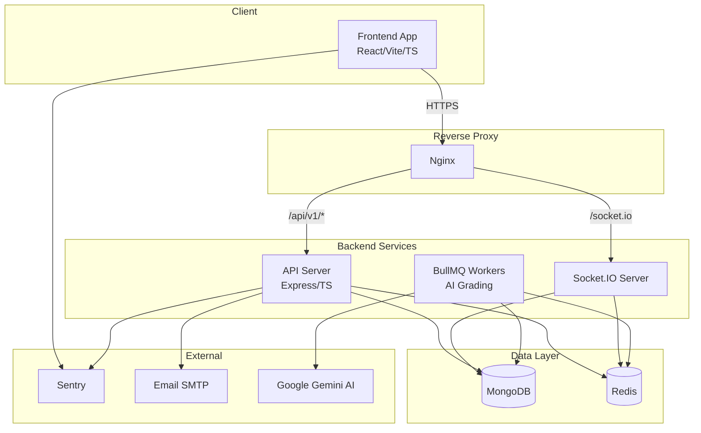
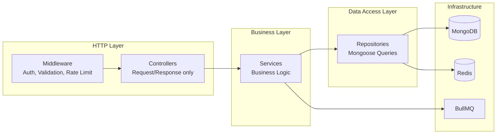
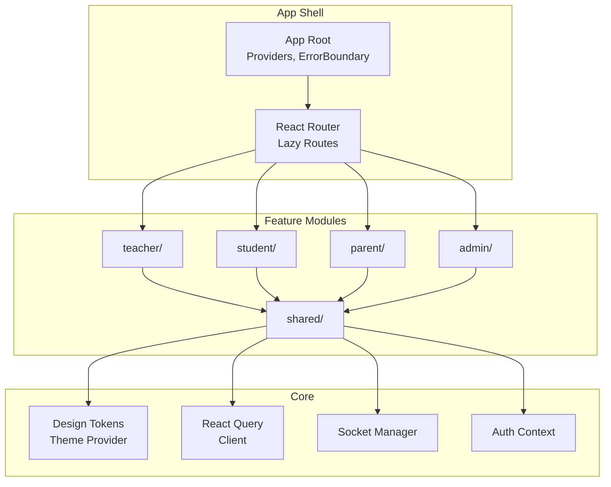

# Design Document: Gurukul AI Modernization

## Overview

This design addresses the comprehensive modernization of the Gurukul AI educational platform — an Express/MongoDB backend with a React/Vite frontend serving Teachers, Students, Parents, and Admins. The modernization covers 12 requirement areas: dependency updates, API restructuring, database optimization, auth hardening, frontend architecture, UI/UX design system, AI grading pipeline, real-time communication, testing, CI/CD, observability, and security.

The guiding principle is **incremental migration** — the system continues to function at each step. We convert JavaScript to TypeScript module-by-module, introduce layered architecture via new service/repository abstractions, and layer new capabilities (refresh tokens, PBT, Docker) atop existing infrastructure.

### Key Design Decisions

| Decision | Choice | Rationale |
|----------|--------|-----------|
| Module system (backend) | ESM (`import`/`export`) | Requirement 1.4; aligns backend with frontend; enables tree-shaking |
| State management (frontend) | TanStack React Query | Requirement 5.2; already installed; provides caching, dedup, and stale-while-revalidate |
| API versioning | URI path prefix `/api/v1/` | Requirement 2.1; simplest for clients; explicit deprecation path |
| Architecture pattern | Controller → Service → Repository | Requirement 2.6; separates HTTP concerns from business logic from persistence |
| Auth tokens | Short-lived JWT access (15 min) + rotating refresh (7 days) | Requirement 4.1–4.2; limits blast radius of stolen tokens |
| Job queue (AI grading) | BullMQ + Redis | Requirement 7.1; proven, supports concurrency limits and progress events |
| Property-based testing | fast-check (frontend) + fast-check via Jest (backend) | Requirement 9.4; mature JS PBT library |
| Container runtime | Docker multi-stage builds | Requirement 10.1; reproducible, environment-parity |
| Observability | Structured JSON logging (Winston) + Prometheus metrics + Sentry | Requirements 11.1–11.7; existing Winston setup extended |

---

## Architecture

### High-Level System Diagram



### Backend Layered Architecture



### Frontend Module Architecture



---

## Components and Interfaces

### Backend Components

#### 1. API Gateway Layer

```typescript
// src/middleware/validateRequest.ts
import { Request, Response, NextFunction } from 'express';
import { ZodSchema } from 'zod';

export interface ValidationSchemas {
  body?: ZodSchema;
  query?: ZodSchema;
  params?: ZodSchema;
}

export function validateRequest(schemas: ValidationSchemas) {
  return (req: Request, res: Response, next: NextFunction): void => {
    // Validates body, query, params against Zod schemas
    // Returns 400 with { error, message, details[] } on failure
  };
}
```

#### 2. Error Envelope

```typescript
// src/types/api.ts
export interface ApiErrorResponse {
  error: string;       // Machine-readable code: "VALIDATION_ERROR", "NOT_FOUND", etc.
  message: string;     // Human-readable description
  details?: Array<{
    field: string;
    value: unknown;
    reason: string;
  }>;
}

export interface ApiSuccessResponse<T> {
  data: T;
  meta?: {
    page?: number;
    limit?: number;
    total?: number;
  };
}
```

#### 3. Service Layer Interface (Example: Student)

```typescript
// src/services/studentService.ts
export interface IStudentService {
  findById(id: string, requestorId: string, role: UserRole): Promise<StudentDTO>;
  findAll(filters: StudentFilters, pagination: Pagination): Promise<PaginatedResult<StudentDTO>>;
  create(data: CreateStudentInput): Promise<StudentDTO>;
  update(id: string, data: UpdateStudentInput): Promise<StudentDTO>;
  softDelete(id: string): Promise<void>;
}
```

#### 4. Repository Layer Interface

```typescript
// src/repositories/baseRepository.ts
export interface IBaseRepository<T> {
  findById(id: string): Promise<T | null>;
  findMany(filter: FilterQuery<T>, options: QueryOptions): Promise<T[]>;
  create(data: Partial<T>): Promise<T>;
  update(id: string, data: Partial<T>): Promise<T | null>;
  softDelete(id: string): Promise<void>;
  count(filter: FilterQuery<T>): Promise<number>;
}
```

#### 5. Auth Token Service

```typescript
// src/services/authTokenService.ts
export interface TokenPair {
  accessToken: string;   // 15 min expiry
  refreshToken: string;  // 7 day expiry
}

export interface IAuthTokenService {
  generateTokenPair(userId: string, role: UserRole): Promise<TokenPair>;
  refreshTokens(refreshToken: string): Promise<TokenPair>;
  revokeTokenFamily(userId: string): Promise<void>;
  validateAccessToken(token: string): Promise<DecodedToken>;
}
```

#### 6. AI Grading Pipeline

```typescript
// src/services/gradingService.ts
export interface GradingJobInput {
  batchId: string;
  teacherId: string;
  submissions: Array<{
    submissionId: string;
    fileUrl: string;
    fileSize: number;
    mimeType: string;
  }>;
  concurrency?: number; // 1-20, default 5
}

export interface GradingResult {
  submissionId: string;
  score: number;
  maxScore: number;
  confidence: number;     // 0-1
  explanation: string;    // max 500 chars
  status: 'success' | 'failed';
  failureReason?: string;
}

export interface IGradingService {
  submitBatch(input: GradingJobInput): Promise<{ jobId: string }>;
  getJobProgress(jobId: string): Promise<JobProgress>;
  cancelJob(jobId: string): Promise<void>;
}
```

#### 7. Real-time Layer

```typescript
// src/realtime/socketManager.ts
export interface ISocketManager {
  authenticateConnection(token: string): Promise<DecodedToken>;
  joinConversation(userId: string, conversationId: string): void;
  broadcastMessage(conversationId: string, message: MessageDTO): void;
  emitTypingIndicator(conversationId: string, userId: string, isTyping: boolean): void;
  emitDeliveryConfirmation(userId: string, messageId: string): void;
  deliverMissedMessages(userId: string, lastMessageTimestamp: Date): Promise<void>;
}
```

### Frontend Components

#### 1. Feature Module Structure

```
src/
├── features/
│   ├── teacher/
│   │   ├── components/
│   │   ├── hooks/
│   │   ├── services/
│   │   ├── types.ts
│   │   └── index.ts          # barrel export
│   ├── student/
│   │   └── index.ts
│   ├── parent/
│   │   └── index.ts
│   ├── admin/
│   │   └── index.ts
│   └── shared/
│       ├── components/
│       │   ├── ErrorBoundary/
│       │   ├── SkeletonLoaders/
│       │   ├── DataTable/
│       │   └── FormFields/
│       ├── hooks/
│       │   ├── useAuth.ts
│       │   ├── useSocket.ts
│       │   └── useTheme.ts
│       └── index.ts
├── design-system/
│   ├── tokens/
│   │   ├── colors.ts
│   │   ├── typography.ts
│   │   ├── spacing.ts
│   │   └── elevation.ts
│   ├── theme/
│   │   ├── lightTheme.ts
│   │   ├── darkTheme.ts
│   │   └── createTheme.ts
│   └── index.ts
├── providers/
│   ├── QueryProvider.tsx
│   ├── ThemeProvider.tsx
│   ├── AuthProvider.tsx
│   └── SocketProvider.tsx
└── app/
    ├── routes.tsx            # lazy-loaded route definitions
    ├── App.tsx
    └── main.tsx
```

#### 2. Design Token System

```typescript
// src/design-system/tokens/spacing.ts
export const spacing = {
  unit: 4,          // base 4px grid
  xs: 4,
  sm: 8,
  md: 16,
  lg: 24,
  xl: 32,
  xxl: 48,
} as const;

// src/design-system/tokens/elevation.ts
export const elevation = {
  none: 'none',
  low: '0 1px 3px rgba(0,0,0,0.12), 0 1px 2px rgba(0,0,0,0.08)',
  medium: '0 4px 6px rgba(0,0,0,0.1), 0 2px 4px rgba(0,0,0,0.06)',
  high: '0 10px 20px rgba(0,0,0,0.12), 0 4px 8px rgba(0,0,0,0.06)',
  overlay: '0 20px 40px rgba(0,0,0,0.15), 0 8px 16px rgba(0,0,0,0.1)',
} as const;

// src/design-system/tokens/typography.ts
export const typography = {
  h1: { fontSize: '2.5rem', fontWeight: 700, lineHeight: 1.2 },
  h2: { fontSize: '2rem', fontWeight: 600, lineHeight: 1.3 },
  h3: { fontSize: '1.5rem', fontWeight: 600, lineHeight: 1.4 },
  h4: { fontSize: '1.25rem', fontWeight: 500, lineHeight: 1.4 },
  body1: { fontSize: '1rem', fontWeight: 400, lineHeight: 1.6 },
  body2: { fontSize: '0.875rem', fontWeight: 400, lineHeight: 1.5 },
  caption: { fontSize: '0.75rem', fontWeight: 400, lineHeight: 1.4 },
} as const;
```

#### 3. Error Boundary Hierarchy

```typescript
// Layout-level boundary wraps all page content
// Page-level boundary wraps individual page components
// Component-level boundaries for critical widgets

// src/features/shared/components/ErrorBoundary/AppErrorBoundary.tsx
export function AppErrorBoundary({ children }: { children: React.ReactNode }) {
  return (
    <ErrorBoundary
      FallbackComponent={FullPageErrorFallback}
      onError={(error) => Sentry.captureException(error)}
      onReset={() => window.location.reload()}
    >
      {children}
    </ErrorBoundary>
  );
}

// src/features/shared/components/ErrorBoundary/PageErrorBoundary.tsx
export function PageErrorBoundary({ children }: { children: React.ReactNode }) {
  return (
    <ErrorBoundary
      FallbackComponent={InlineErrorFallback}  // Shows message + retry button
      onError={(error) => Sentry.captureException(error)}
    >
      {children}
    </ErrorBoundary>
  );
}
```

---

## Data Models

### Updated MongoDB Schemas

#### Student (with soft-delete)

```typescript
interface IStudent {
  _id: ObjectId;
  firstName: string;
  lastName: string;
  email: string;
  password: string;           // bcrypt hash, cost factor 12
  studentId: string;
  grade: string;
  dateOfBirth?: Date;
  parentName?: string;
  parentEmail?: string;
  parentPhone?: string;
  address?: string;
  avatar?: string;
  active: boolean;
  deletedAt?: Date;           // soft-delete field
  failedLoginAttempts: number;
  lockedUntil?: Date;
  createdAt: Date;
  updatedAt: Date;
}
```

#### RefreshToken (new collection)

```typescript
interface IRefreshToken {
  _id: ObjectId;
  userId: ObjectId;
  userModel: 'Student' | 'Faculty' | 'Parent' | 'Admin';
  tokenHash: string;         // SHA-256 hash of the token
  familyId: string;          // UUID grouping related tokens
  expiresAt: Date;
  revokedAt?: Date;
  replacedByTokenHash?: string;
  createdAt: Date;
}
// Indexes: { userId: 1, familyId: 1 }, { expiresAt: 1 } (TTL)
```

#### GradingJob (new collection)

```typescript
interface IGradingJob {
  _id: ObjectId;
  batchId: string;
  teacherId: ObjectId;
  status: 'pending' | 'processing' | 'completed' | 'completed_with_failures';
  totalSubmissions: number;
  processedCount: number;
  successCount: number;
  failureCount: number;
  concurrency: number;
  submissions: Array<{
    submissionId: string;
    fileUrl: string;
    fileSize: number;
    mimeType: string;
    status: 'pending' | 'processing' | 'success' | 'failed';
    retryCount: number;
    result?: {
      score: number;
      maxScore: number;
      confidence: number;
      explanation: string;
    };
    failureReason?: string;
  }>;
  startedAt?: Date;
  completedAt?: Date;
  createdAt: Date;
  updatedAt: Date;
}
// Indexes: { teacherId: 1, status: 1 }, { batchId: 1 }
```

#### AuditLog (new collection)

```typescript
interface IAuditLog {
  _id: ObjectId;
  timestamp: Date;
  actor: {
    userId: ObjectId;
    role: string;
    ip: string;
  };
  action: 'login' | 'logout' | 'password_change' | 'role_modification' | 'failed_auth' | 'account_locked';
  target: {
    resource: string;
    resourceId?: string;
  };
  metadata?: Record<string, unknown>;
  correlationId: string;
}
// Indexes: { timestamp: -1 }, { 'actor.userId': 1 }, { correlationId: 1 }
```

#### Message (updated schema)

```typescript
// Additional fields added to existing Message schema:
interface IMessageUpdate {
  deliveredAt?: Date;        // Delivery timestamp
  deliveryStatus: 'pending' | 'delivered' | 'failed';
  persistedAt: Date;         // When persisted to DB (before delivery confirmation)
}
```

### Database Indexes (Requirement 3.1)

```javascript
// Compound indexes for query performance
Attendance: { enrollment: 1, date: -1 }
Enrollment: { student: 1, course: 1 }
Mark: { enrollment: 1, type: 1 }
Message: { senderId: 1, recipientId: 1, createdAt: -1 }
RefreshToken: { userId: 1, familyId: 1 }
GradingJob: { teacherId: 1, status: 1 }
AuditLog: { timestamp: -1, 'actor.userId': 1 }
```

### Connection Pool Configuration

```typescript
// src/config/database.ts
export const mongooseOptions: ConnectOptions = {
  minPoolSize: parseInt(process.env.MONGO_MIN_POOL || '2'),
  maxPoolSize: Math.min(parseInt(process.env.MONGO_MAX_POOL || '10'), 50),
  serverSelectionTimeoutMS: 30000,
  socketTimeoutMS: 30000,
};
```

---


## Correctness Properties

*A property is a characteristic or behavior that should hold true across all valid executions of a system — essentially, a formal statement about what the system should do. Properties serve as the bridge between human-readable specifications and machine-verifiable correctness guarantees.*

### Property 1: API Error Envelope Consistency

*For any* HTTP request that results in a 4xx or 5xx response from the API, the response body SHALL contain at minimum the fields `error` (string, machine-readable code) and `message` (string, human-readable description), and for validation errors (400) SHALL additionally contain a `details` array with field/value/reason entries.

**Validates: Requirements 2.2, 2.7, 2.8**

### Property 2: Unhandled Exception Information Hiding

*For any* unhandled exception thrown during request processing, the HTTP response SHALL have status 500 with a static message, and SHALL NOT contain any stack trace, file path, database identifier, or environment variable value.

**Validates: Requirements 2.4**

### Property 3: Request Validation Rejects Unknown Fields

*For any* HTTP request body containing fields not defined in the endpoint's validation schema, the Backend_Service SHALL reject the request with HTTP 400 before executing controller logic.

**Validates: Requirements 2.3**

### Property 4: Soft-Delete Exclusion

*For any* record in a soft-deletable collection (Student, Faculty, Parent, Course, Message) that has a non-null `deletedAt` field, that record SHALL NOT appear in the results of standard find/list queries unless the caller explicitly includes deleted records.

**Validates: Requirements 3.5**

### Property 5: Schema Validation Consistency

*For any* document submitted to a soft-deletable collection that violates a Mongoose schema validation rule, the write operation SHALL be rejected with an error identifying the invalid field and the violated constraint.

**Validates: Requirements 3.6**

### Property 6: Token Lifetime Bounds

*For any* generated token pair, the access token's expiration SHALL be at most 15 minutes from issuance and the refresh token's expiration SHALL be at most 7 days from issuance.

**Validates: Requirements 4.1**

### Property 7: Refresh Token Rotation Invalidation

*For any* refresh token that is consumed to generate a new token pair, the consumed token SHALL be marked as invalidated and SHALL NOT be usable for generating another token pair.

**Validates: Requirements 4.2**

### Property 8: Token Family Revocation on Replay

*For any* refresh token that has already been consumed (invalidated), if it is presented again for refresh, the Auth_System SHALL revoke all tokens in that token's family, requiring full re-authentication.

**Validates: Requirements 4.8**

### Property 9: RBAC Data Isolation

*For any* two distinct students A and B, a request authenticated as student A to access student B's records SHALL be rejected with HTTP 403. *For any* parent, data access SHALL be limited to their linked ward's records only.

**Validates: Requirements 4.3**

### Property 10: Authentication Status Codes

*For any* protected endpoint, a request without a valid authentication token SHALL receive HTTP 401, and a request with a valid token but insufficient role permissions SHALL receive HTTP 403.

**Validates: Requirements 4.4**

### Property 11: Password Hashing Strength

*For any* newly created or updated user password, the stored value SHALL be a bcrypt hash with a cost factor of at least 12.

**Validates: Requirements 4.5, 12.5**

### Property 12: Theme Persistence Round-Trip

*For any* theme preference value (light or dark), storing it in localStorage and retrieving it SHALL return the same value, and the retrieved value SHALL be applied to the application on load.

**Validates: Requirements 6.2**

### Property 13: Responsive Layout No-Overflow

*For any* viewport width between 320px and 2560px, no page in the application SHALL exhibit horizontal scrolling or content overflow outside its container.

**Validates: Requirements 6.5**

### Property 14: Grading Batch Size Validation

*For any* batch submission with a size between 1 and 200 (inclusive), the AI_Pipeline SHALL accept the batch. *For any* batch with size exceeding 200, the AI_Pipeline SHALL reject it with an error indicating the maximum allowed size.

**Validates: Requirements 7.1**

### Property 15: Grading Progress Event Count

*For any* batch of N submissions processed by the AI_Pipeline, exactly N progress events SHALL be emitted, each reporting the correct count of processed submissions out of the total.

**Validates: Requirements 7.2**

### Property 16: Grading Failure Isolation

*For any* individual submission that fails processing, the AI_Pipeline SHALL retry it up to 3 times, and the failure SHALL NOT affect the processing status or results of other submissions in the same batch.

**Validates: Requirements 7.3**

### Property 17: Grading Result Metadata Invariants

*For any* successfully produced grade, the confidence score SHALL be in the range [0, 1] (inclusive) and the explanation text SHALL be at most 500 characters in length.

**Validates: Requirements 7.5**

### Property 18: Grading File Validation

*For any* submission file with size exceeding 20 MB or a MIME type not in {PDF, JPEG, PNG}, the AI_Pipeline SHALL reject the file with a specific error before processing begins.

**Validates: Requirements 7.6**

### Property 19: Grading Batch Completion Count Invariant

*For any* completed batch, the batch-completion event SHALL report counts where `successCount + failureCount == totalSubmissions`.

**Validates: Requirements 7.7**

### Property 20: Typing Indicator Rate Limiting

*For any* sequence of typing events from a single user in a conversation, the Realtime_Layer SHALL not broadcast typing indicators more frequently than once every 3 seconds.

**Validates: Requirements 8.3**

### Property 21: Missed Message Delivery on Reconnection

*For any* set of messages sent to a user while they are disconnected, all such messages SHALL be delivered to the user upon their next successful WebSocket connection, using the last-received message timestamp as the synchronization point.

**Validates: Requirements 8.5, 8.8**

### Property 22: Message Persistence Before Confirmation

*For any* message processed by the Realtime_Layer, the message SHALL be persisted to the database before a delivery confirmation event is emitted to the sender.

**Validates: Requirements 8.6**

### Property 23: Messaging RBAC Restrictions

*For any* user pair (sender, recipient), messaging SHALL only be permitted if the relationship satisfies: Students can message only assigned Teachers, Parents can message only their ward's Teachers, Teachers can message Students/Parents within their courses. All other pairs SHALL be rejected.

**Validates: Requirements 8.9**

### Property 24: Grade Calculation Correctness

*For any* set of marks with scores, max scores, and weights, the computed weighted average grade SHALL equal the sum of (score/maxScore × weight) divided by the sum of weights, within floating-point tolerance.

**Validates: Requirements 9.4**

### Property 25: Attendance Percentage Computation

*For any* set of attendance records for a student in a course, the attendance percentage SHALL equal (present count / total count) × 100, rounded to the nearest integer.

**Validates: Requirements 9.4**

### Property 26: Input Sanitization Idempotence

*For any* string input, applying the sanitization function twice SHALL produce the same result as applying it once (idempotent), and the output SHALL contain no raw HTML tags or executable script content.

**Validates: Requirements 9.4, 12.1**

### Property 27: Structured Log Completeness

*For any* HTTP request processed by the Backend_Service, the corresponding structured JSON log entry SHALL contain all required fields: requestId, userId (if authenticated), role (if authenticated), endpoint, HTTP method, response status code, and response time in milliseconds.

**Validates: Requirements 11.1**

### Property 28: Correlation ID Presence

*For any* HTTP request, whether or not it includes a correlation ID header, the response SHALL include a correlation ID in its headers, and all log entries for that request SHALL reference the same correlation ID.

**Validates: Requirements 11.6, 11.7**

### Property 29: Health Endpoint Service Status

*For any* combination of dependent service states (database, cache, external APIs), the /health endpoint SHALL report each service's actual status as "connected", "degraded", or "disconnected" based on a connectivity check completing within 5 seconds.

**Validates: Requirements 11.4, 11.8**

### Property 30: NoSQL Injection Prevention

*For any* user-provided input containing MongoDB query operators (e.g., `$gt`, `$ne`, `$regex`, `$where`), the Backend_Service SHALL either sanitize the input to treat operators as literal strings OR reject the request with HTTP 400 and log a security event.

**Validates: Requirements 12.2, 12.8**

### Property 31: CSRF Protection for State-Changing Endpoints

*For any* POST, PUT, DELETE, or PATCH request lacking a valid CSRF token or SameSite cookie protection, the Backend_Service SHALL reject the request.

**Validates: Requirements 12.4**

### Property 32: Security Audit Trail

*For any* security-relevant event (login, password change, role modification, failed authentication), the system SHALL create an audit log entry containing: timestamp, actor identity, action performed, target resource, and source IP address.

**Validates: Requirements 12.6**

### Property 33: Request Size Enforcement

*For any* request with a body exceeding 10 MB or a single input field exceeding 10,000 characters, the Backend_Service SHALL reject the request with an error indicating the payload exceeds the allowed size limit.

**Validates: Requirements 12.7**

---

## Error Handling

### Backend Error Strategy

| Layer | Error Type | Handling |
|-------|-----------|----------|
| Middleware (Validation) | Invalid input | 400 with `{ error: "VALIDATION_ERROR", message, details[] }` |
| Middleware (Auth) | Missing/expired token | 401 with `{ error: "UNAUTHORIZED", message }` |
| Middleware (RBAC) | Insufficient permissions | 403 with `{ error: "FORBIDDEN", message }` |
| Controller | Resource not found | 404 with `{ error: "NOT_FOUND", message }` |
| Service | Business rule violation | 422 with `{ error: "UNPROCESSABLE", message }` |
| Service | Conflict (duplicate) | 409 with `{ error: "CONFLICT", message }` |
| Repository | Database timeout | 503 with `{ error: "SERVICE_UNAVAILABLE", message }` |
| Global | Unhandled exception | 500 with `{ error: "INTERNAL_ERROR", message: "An internal error occurred" }` |

### Error Handling Implementation

```typescript
// src/middleware/errorHandler.ts
export class AppError extends Error {
  constructor(
    public readonly statusCode: number,
    public readonly errorCode: string,
    message: string,
    public readonly details?: Array<{ field: string; value: unknown; reason: string }>
  ) {
    super(message);
  }
}

export function globalErrorHandler(err: Error, req: Request, res: Response, _next: NextFunction) {
  const correlationId = req.headers['x-correlation-id'] || req.correlationId;

  if (err instanceof AppError) {
    logger.warn({ correlationId, error: err.errorCode, path: req.path });
    return res.status(err.statusCode).json({
      error: err.errorCode,
      message: err.message,
      ...(err.details && { details: err.details }),
    });
  }

  // Unhandled: log full stack, return static message
  logger.error({ correlationId, stack: err.stack, path: req.path });
  return res.status(500).json({
    error: 'INTERNAL_ERROR',
    message: 'An internal error occurred',
  });
}
```

### Frontend Error Strategy

| Scenario | Handling |
|----------|----------|
| Network failure | React Query retry (3 attempts) → inline error with retry button |
| 401 response | Redirect to login, clear auth state |
| 403 response | Display "access denied" message |
| Component crash | Error boundary catches, shows fallback + retry |
| Skeleton timeout (10s) | Replace skeleton with timeout message + retry |
| WebSocket disconnect | Auto-reconnect with backoff → connection failure banner after 5 attempts |

### AI Pipeline Error Handling

```typescript
// Retry strategy for individual submissions
const retryConfig = {
  maxRetries: 3,
  backoff: {
    type: 'exponential' as const,
    delay: 1000,    // 1s initial
    maxDelay: 30000 // 30s cap
  }
};

// File validation errors reported individually before batch processing
// Metadata generation failures block grade production entirely
```

---

## Testing Strategy

### Testing Pyramid

```
        ╱╲
       ╱ E2E ╲           Playwright: critical user flows
      ╱────────╲
     ╱Integration╲       API integration, Socket.IO, DB
    ╱──────────────╲
   ╱  Property-Based  ╲   fast-check: data transforms, validation
  ╱────────────────────╲
 ╱     Unit Tests        ╲  Jest: services, utilities, components
╱────────────────────────────╲
```

### Property-Based Testing (fast-check)

Property-based testing applies to this feature because the platform has substantial pure-function business logic (grade calculation, attendance computation, input sanitization), data transformation pipelines (serialization, validation), and universal invariants (auth token bounds, RBAC isolation, error envelope format) that vary meaningfully across input space.

**Library**: [fast-check](https://github.com/dubzzz/fast-check) for both frontend and backend
**Minimum iterations**: 100 per property test
**Tag format**: `Feature: gurukul-ai-modernization, Property {N}: {property_text}`

#### Backend Property Tests

| Property | Function Under Test | Generator Strategy |
|----------|--------------------|--------------------|
| P24: Grade calculation | `calculateWeightedGrade()` | Random arrays of {score, maxScore, weight} with valid ranges |
| P25: Attendance percentage | `computeAttendancePercent()` | Random arrays of {date, status} records |
| P26: Sanitization idempotence | `sanitizeInput()` | Arbitrary strings including HTML, script, unicode |
| P1: Error envelope | Error middleware | Random error types and status codes |
| P2: Info hiding | Error middleware | Random exceptions with stack traces |
| P6: Token lifetime | `generateTokenPair()` | Random user IDs and roles |
| P11: Password hashing | `hashPassword()` | Random password strings |
| P17: Grade metadata | AI grading result | Random scores and text lengths |
| P30: Injection prevention | Input sanitization | Strings containing $-prefixed operators |
| P33: Size enforcement | Size-check middleware | Random payloads of varying sizes |

#### Frontend Property Tests

| Property | Function Under Test | Generator Strategy |
|----------|--------------------|--------------------|
| P12: Theme round-trip | `persistTheme()` / `loadTheme()` | Random theme enum values |
| P26: Sanitization | Display sanitization | Arbitrary HTML strings |

### Unit Testing

- **Backend**: Jest with Supertest for controller tests, mock repositories for service tests
- **Frontend**: Vitest with React Testing Library for component tests
- **Coverage target**: ≥80% line coverage for controllers, services, middleware

### Integration Testing

- **API integration**: Full request lifecycle with in-memory MongoDB (mongodb-memory-server)
- **Socket.IO**: socket.io-client tests against test server
- **AI Pipeline**: BullMQ with mock Gemini responses

### E2E Testing

- **Tool**: Playwright
- **Flows**: Login, dashboard navigation, attendance viewing, message sending, assignment submission
- **Each flow**: Success path + at least one error path

### Visual Regression Testing

- **Tool**: Storybook + Chromatic (or Percy)
- **Threshold**: 0.1% pixel diff
- **Coverage**: All Component_Library components

### Load Testing

- **Tool**: k6
- **Scenario**: 500 concurrent users — login, dashboard, attendance, messages
- **SLO**: p95 response time < 1 second over 5 minutes

### CI Integration

- All tests run on PR open
- Property tests: `jest --testPathPattern=property` with minimum 100 iterations
- Coverage enforcement: fail if < 80%
- Test duration warning at 15 minutes

---
