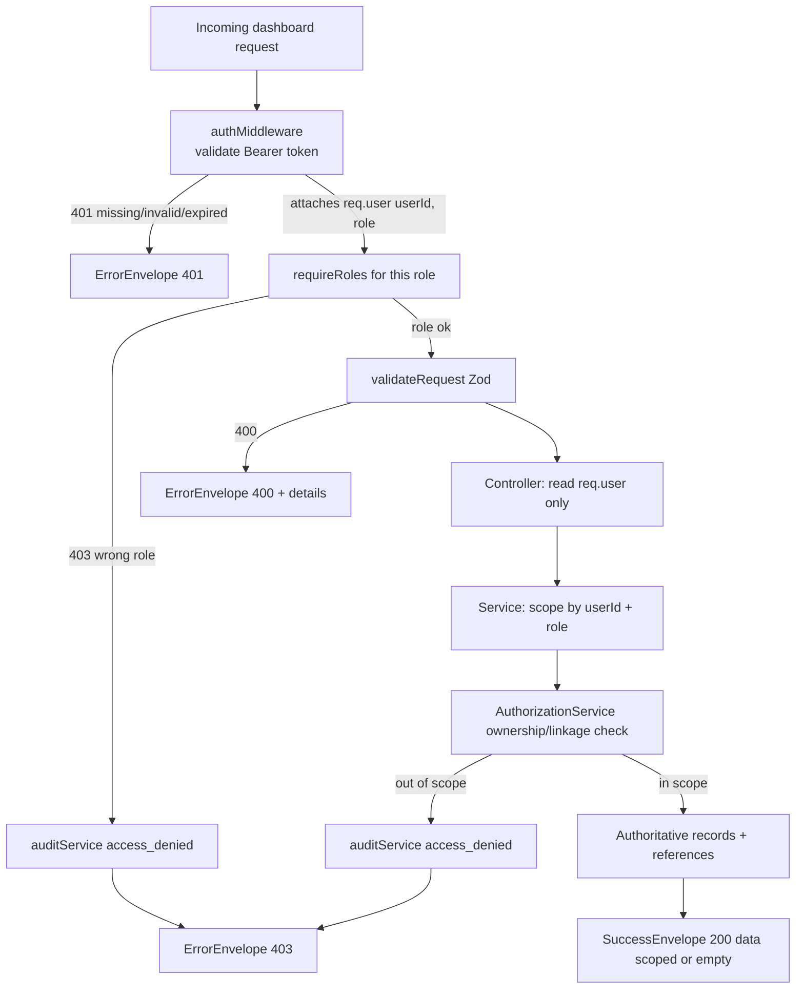
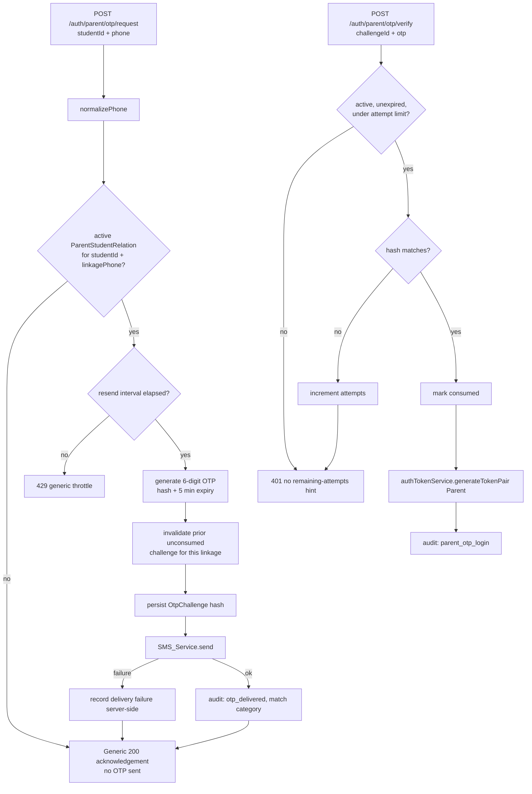

# Design Document

## Overview

This feature delivers personalized, role-scoped dashboards for the four roles on the Gurukul AI platform (`admin`, `faculty`/teacher, `student`, `parent`) and a verified parent OTP login flow. It is the next milestone on top of the completed `secure-admin-user-management` spec (JWT auth, RBAC, admin-driven account/credential management, `AuditLog`, per-endpoint rate limiting) and the `student-parent-api-routes` spec (the `/api/students/me/*` and `/api/parents/me/*` data routes and the `parent_student_relations` linkage collection).

The design is deliberately additive and reuses the existing building blocks rather than rebuilding them:

| Existing asset | Role in this feature |
| --- | --- |
| `authMiddleware` (`middleware/authMiddleware.ts`) | Validates the Bearer access token, attaches `{ userId, role }` |
| `requireRoles(...)` / `adminOnly` / `parentOnly` (`middleware/rbacMiddleware.ts`) | Enforces role, audits 403 denials, exposes `__roles` to the route map |
| `AuthorizationService` (`services/authorizationService.ts`) | Per-record ownership checks (student self, faculty course/student, parent→child linkage) |
| `validateRequest` (`middleware/validateRequest.ts`) | Zod body/query/params validation → 400 with `details[]` |
| `AppError` + `globalErrorHandler` | Standard error envelope, no stack-trace leakage |
| `success` / `failure` (`utils/envelope.ts`) | Canonical `{ success, data, meta? }` / `{ success, message, details? }` |
| `Student` / `Faculty` / `Parent` models | bcrypt hashing, `active`/`isActive`, `deletedAt`, setup-token fields |
| `authTokenService` | Access/refresh token pair issuance for the parent session |
| `auditService` + `AuditLog` model | Sensitive-action audit trail |
| `adminManagementRateLimit` / `adminRateLimiter` (`middleware/rateLimiter.ts`) | Per-IP failed-attempt throttling reused for OTP endpoints |
| `studentMeService` / `parentMeService` | Self-scoped data reads that dashboards consume |
| `seedAllUsers.js` | Existing idempotent relational seed graph extended with a demo marker |

The work divides into five areas, mapped to the five requirement pillars:

1. **Personalized greeting (Req 1)** — a pure, deterministic greeting function driven by the user's local time and the first name from the authoritative record, with a safe fallback when the name is unavailable.
2. **Server-side per-user scoping (Req 2, 3)** — every dashboard-feeding endpoint derives its scope from `req.user` (never from client-supplied identifiers) and resolves data through references to the authoritative `Student`/`Faculty` records. A new `facultyMeService`/`facultyMeController` completes the teacher self-scope surface (own classes, courses, students, schedule).
3. **Verified parent linkage + OTP (Req 4, 5, 6, 7)** — the in-memory OTP store in `authController` is replaced with a persistent, hashed, single-use, time-limited `OtpChallenge` tied to a verified `(studentId, normalized phone)` linkage, with anti-enumeration responses, attempt limits, and resend throttling. The `parent_student_relations` linkage is promoted to a first-class `ParentStudentRelation` model carrying a normalized `linkagePhone`.
4. **Auditing (Req 8)** — parent OTP login, OTP delivery outcome, and scope denials are written to `AuditLog` with secrets redacted.
5. **Friendly states + data reset (Req 9, 10)** — consistent empty/error envelopes and a shared frontend empty-state component, plus an environment-guarded, idempotent demo-data reset keyed on a persisted `isDemo` marker, with real onboarding flowing through the existing admin flows.

### Resolved open questions (design decisions)

The requirements listed six open questions. They are resolved here as follows, and any item with operational impact is reflected in the design:

1. **SMS/OTP provider** — `SMS_Service` is a pluggable interface selected by the `SMS_PROVIDER` env var. Two transports ship: a `ConsoleSmsTransport` (default in non-production; logs a redacted line, never the code at `info`) and a `TwilioSmsTransport` adapter (used when `SMS_PROVIDER=twilio` and credentials are present). Adding a provider means adding one adapter; no caller changes.
2. **Per-role dashboard contents** — defined in the Components section as a fixed summary contract per role, all derived from authoritative records. Widgets beyond these are out of scope for this milestone.
3. **Real-data source** — admin-driven manual entry through the existing `secure-admin-user-management` create flows; no fabricated credentials. Bulk import is out of scope.
4. **Demo-data-removal authorization** — the reset mechanism refuses to run unless an explicit `--confirm` flag and an explicit `--env <name>` are supplied, and aborts when the resolved environment is `production` unless `ALLOW_PROD_RESET=true` is also set. Identification of "production" is by `NODE_ENV`/named env.
5. **Parent identity model** — the canonical linkage lives in `ParentStudentRelation` with the phone normalized there as `linkagePhone`. `Student.parentPhone` is retained for backward compatibility and display but is no longer authoritative for OTP matching; the reset/onboarding path keeps it in sync best-effort.
6. **OTP parameters** — defaults from the requirements are used and centralized as constants: 6 digits, 5-minute expiry, 5 max attempts, 60-second resend interval. They are configurable via env without code change.

### Scope boundaries

- Reuses existing `/me` data routes; adds teacher `/me` routes and per-role dashboard summary endpoints.
- Does not redesign the visual theme; it adds shared greeting and empty-state primitives.
- Does not introduce a new session model for parents; it reuses `authTokenService` token pairs.

## Architecture

### Request pipeline for a dashboard endpoint



The fixed order **`authMiddleware` → `requireRoles(...)` → `validateRequest` → controller → service → `AuthorizationService`** guarantees that an unauthenticated caller always gets 401 before any role or scope check runs (Req 2.7), and that a wrong-role caller gets 403 before the handler executes (Req 2.8). Scope is always derived from `req.user`, never from a client-supplied identifier (Req 2.2).

### Parent OTP login flow



### Layering

The codebase follows **routes → controllers → services → repositories/models**, and this design preserves it. New OTP and greeting logic lives in HTTP-agnostic services and pure utilities so it is unit- and property-testable in isolation:

- **`utils/greeting.ts`** — pure `computeGreeting(localHour, firstName)` (shared contract; the frontend owns the rendering copy).
- **`utils/phone.ts`** — pure `normalizePhone(raw)` canonicalization.
- **`services/otpService.ts`** — challenge generation, verification, attempt/resend policy (no HTTP).
- **`services/smsService.ts`** — pluggable `SMS_Service` with console + Twilio transports.
- **`services/facultyMeService.ts`** — teacher self-scoped reads.
- **`services/parentLinkageService.ts`** — admin linkage create/deactivate, normalized storage.

## Components and Interfaces

### 1. Greeting (Req 1)

A pure function shared in contract between backend and frontend. The frontend computes the greeting because it knows the browser's local time (Req 1's `Local_Time`); the first name is sourced from `GET /api/v1/auth/me` (already returns `firstName` from the authoritative record).

```ts
// utils/greeting.ts
export type TimeOfDayPhrase = 'Good morning' | 'Good afternoon' | 'Good evening';

/** Select the phrase from a 0–23 local hour (Req 1.2–1.5). */
export function phraseForHour(localHour: number): TimeOfDayPhrase;

/**
 * Build the greeting. When firstName is null/blank/unavailable, return the
 * phrase alone with no trailing token (Req 1.6: never "undefined"/"null").
 */
export function computeGreeting(localHour: number, firstName?: string | null): string;
```

Boundaries (Req 1.2–1.5): `[5,12) → morning`, `[12,17) → afternoon`, `[17,24) → evening`, `[0,5) → evening`. Name fallback (Req 1.6): trim the name; if empty/nullish, return just the phrase (`"Good morning"`), otherwise `"${phrase}, ${firstName}"`.

### 2. Per-role dashboard summary endpoints (Req 2, 3, 9)

Each role gets one summary endpoint returning a scoped, authoritative-record-derived payload. All read `req.user` only.

| Endpoint | Role | Source (authoritative) | Summary payload |
| --- | --- | --- | --- |
| `GET /api/students/me/dashboard` | `student` | own `Student` + active `Enrollment`/`Mark`/`Attendance` | profile (firstName/grade), active course count, recent grades, attendance rate |
| `GET /api/faculty/me/dashboard` | `faculty`,`admin` | own `Faculty` + owned `Course` + their enrolled students | profile, owned course count, total students, today's schedule |
| `GET /api/parents/me/dashboard` | `parent` | linked `Student`s via active `ParentStudentRelation` | children list, per-child summary derived from each child's records |
| `GET /api/admin/dashboard` | `admin` | aggregate counts over authoritative collections | totals (students, faculty, parents, courses), recent audit highlights |

Teacher self-scope routes (new `facultyMeRoutes.ts`, mounted under `/api/faculty`) complete Req 2.4:

```ts
// services/facultyMeService.ts
class FacultyMeService {
  getProfile(facultyId: string): Promise<FacultyProfileDTO>;          // own Faculty record
  getCourses(facultyId: string): Promise<CourseDTO[]>;                // Course.faculty === facultyId, deletedAt null
  getStudents(facultyId: string): Promise<StudentSummaryDTO[]>;       // enrolled in own courses, distinct
  getSchedule(facultyId: string, day?: Weekday): Promise<ScheduleSlotDTO[]>; // from own courses' schedule[]
}
```

`getStudents` resolves students through `Enrollment.course ∈ {own courses}` references rather than copied identity fields (Req 3.3), and joins to the authoritative `Student` record for display fields (Req 3.1).

### 3. Active-record filtering rule (Req 3.4, 3.5)

A shared helper expresses the listing rule so it is applied uniformly:

```ts
// utils/recordFilter.ts
/** A record appears in an "active members" listing iff active === true AND it
 *  satisfies every additional predicate for that listing. */
export function isListable<T>(record: T & { active?: boolean }, predicates: Array<(r: T) => boolean>): boolean;
```

Listings filter on `active === true` plus endpoint-specific predicates. Crucially, **reference resolution does not filter on `active`**: a historical `Enrollment`/`Mark`/`Attendance` whose owning `Student`/`Faculty` is now inactive still resolves and returns that record's data (Req 3.4). Listings use `isListable`; reference resolution uses `findById`-style lookups with no `active` constraint.

### 4. Verified parent linkage + OTP (Req 4, 5, 6, 7)

#### `ParentStudentRelation` model (promoted, Req 7)

The linkage previously declared inline in `authorizationService`/`parentMeService`/seed is promoted to `models/ParentStudentRelation.ts`, bound to the existing `parent_student_relations` collection so existing data is preserved:

```ts
interface IParentStudentRelation {
  parentId: Types.ObjectId;   // ref Parent
  studentId: Types.ObjectId;  // ref Student
  linkagePhone: string;       // canonical/normalized phone (Req 7.1, 4.6)
  isActive: boolean;          // Req 7.2
  isDemo?: boolean;           // demo marker (Req 10.1)
  createdAt: Date; updatedAt: Date;
}
// Unique partial index on { studentId, linkagePhone, isActive:true } for idempotent linking (Req 7.3)
```

#### `parentLinkageService` (new, admin-only, Req 7)

```ts
class ParentLinkageService {
  // Stores linkagePhone normalized; idempotent on (studentId, linkagePhone) (Req 7.1, 7.3)
  link(parentId: string, studentId: string, phone: string, ctx: AuditContext): Promise<LinkageDTO>;
  // Sets isActive=false; subsequent OTP requests treat the pair as non-matching (Req 7.2)
  unlink(relationId: string, ctx: AuditContext): Promise<void>;
  // Non-admin list responses mask the phone; admin sees full detail (Req 7.5)
  listForStudent(studentId: string, viewerRole: UserRole): Promise<LinkageDTO[]>;
}
```

Routes require `adminOnly` (Req 7.4). List DTOs to non-admin callers carry a masked phone (e.g. `•••• ••1234`).

#### `OtpChallenge` model (new, Req 5)

```ts
interface IOtpChallenge {
  relationId: Types.ObjectId;  // the matched ParentStudentRelation
  parentId: Types.ObjectId;
  studentId: Types.ObjectId;
  otpHash: string;             // sha256/bcrypt of code — never plaintext (Req 5.2)
  expiresAt: Date;             // creation + 5 min (Req 5.3)
  attempts: number;            // incremented on wrong guess (Req 6.2)
  consumedAt?: Date;           // single-use (Req 5.5)
  lastSentAt: Date;            // resend throttle (Req 6.4)
  createdAt: Date;
}
// TTL index on expiresAt; index on relationId for "latest active" lookups.
```

#### `otpService` (new, Req 4, 5, 6)

```ts
class OtpService {
  /** Matches (studentId, normalizedPhone) → active relation; on match creates a
   *  hashed challenge, invalidates prior unconsumed challenges for the linkage
   *  (Req 5.6), enforces 60s resend (Req 6.4/6.5), and sends via SMS_Service.
   *  ALWAYS returns the same generic acknowledgement (Req 4.3, 4.4). */
  request(studentId: string, phone: string, ctx: RequestContext): Promise<GenericAck>;

  /** Verifies code against the active challenge: expiry → 401 (Req 5.4),
   *  attempts >= 5 → invalidate (Req 6.3), wrong → increment + 401 (Req 6.2),
   *  correct → consume + issue parent token pair (Req 5.5, 6.1). */
  verify(challengeId: string, code: string, ctx: RequestContext): Promise<TokenPair>;
}
```

Generation uses `crypto.randomInt(0, 1_000_000)` zero-padded to 6 digits (cryptographically secure, Req 5.1). The OTP value is never logged or returned (Req 8.4).

#### `SMS_Service` (new, pluggable, Open Q1)

```ts
interface ISmsTransport { send(toPhone: string, body: string): Promise<void>; }
class ConsoleSmsTransport implements ISmsTransport { /* dev/test; logs redacted, never the code */ }
class TwilioSmsTransport implements ISmsTransport { /* prod adapter, env-configured */ }
// selectSmsTransport() reads SMS_PROVIDER; defaults to console outside production.
```

A `send` failure is caught by `otpService`, recorded server-side, and never surfaced to the caller (Req 4.5).

#### Endpoint changes (replacing the in-memory store in `authController`)

| Endpoint | Body | Behavior |
| --- | --- | --- |
| `POST /api/auth/parent/otp/request` | `{ studentId, phoneNumber }` | Generic 200 ack regardless of match (Req 4.3); wrapped in `adminManagementRateLimit` (Req 6.6) |
| `POST /api/auth/parent/otp/verify` | `{ challengeId, otp }` | 200 + token pair on success; 401 otherwise (Req 6.1, 6.2) |

The legacy `sendOtp`/`verifyOtp` handlers and module-level `otpStore` `Map` are removed; `parentLogin` (email/password) is retained unchanged.

### 5. Auditing (Req 8)

Reuses `auditService.logEvent`. New `AuditAction` values are added to the model enum: `parent_otp_login`, `otp_delivered`, `data_reset`. Existing `access_denied` covers scope/role denials (Req 8.3) and is already emitted by `requireRoles`; `AuthorizationService` denials are wrapped to emit `access_denied` as well. All entries pass through `redactSecrets` (`utils/auditContext.ts`) so OTP, password, and raw token values never appear (Req 8.4). `otp_delivered` records only a match-outcome category and never the full phone (Req 8.2).

### 6. Friendly empty/error states (Req 9)

- Empty scope → `200 { success: true, data: [] }` (Req 9.1), already the envelope convention.
- A shared frontend `<EmptyState>` (in `src/features/shared/components`) renders consistent copy/styling across roles (Req 9.2, 9.4).
- Errors flow through `globalErrorHandler` → `failure(message, details?)` with a machine-readable code (Req 9.3); unexpected errors return a generic 500 with no stack traces (Req 9.5).

### 7. Environment-guarded data reset + onboarding (Req 10)

```ts
// scripts/resetDemoData.ts — run via node, never imported by the app
// Guards (abort without mutation unless ALL hold):
//   --confirm present                              (Req 10.2)
//   --env <name> present and matches resolved env  (Req 10.2)
//   resolved env !== production OR ALLOW_PROD_RESET=true (Req 10.3)
// Action: deleteMany({ isDemo: true }) across demo-marked collections only (Req 10.4)
//   leaving Real_Records (isDemo absent/false) untouched.
// Idempotent: re-running yields the same final state (Req 10.5).
// Writes an AuditLog 'data_reset' entry with actor, env, and per-collection counts (Req 10.7).
```

Records get an `isDemo: boolean` marker (added to `Student`, `Faculty`, `Parent`, `ParentStudentRelation`, and related demo docs); `seedAllUsers.js` sets `isDemo: true` on everything it creates. Real onboarding uses the existing admin create flows that generate credentials / setup links and never store fabricated plaintext passwords (Req 10.6).

## Data Models

New and modified persisted shapes (Mongoose), following existing model conventions (timestamps, indexes, `select:false` for secrets):

### `ParentStudentRelation` (promote inline schema → `models/ParentStudentRelation.ts`)
- `parentId: ObjectId(ref Parent, required)`
- `studentId: ObjectId(ref Student, required)`
- `linkagePhone: string(required, normalized E.164-style)`
- `isActive: boolean(default true)`
- `isDemo: boolean(default false)`
- Indexes: partial unique on `{ studentId, linkagePhone }` where `isActive: true`; `{ parentId, isActive }`.

### `OtpChallenge` (new — `models/OtpChallenge.ts`)
- `relationId, parentId, studentId: ObjectId`
- `otpHash: string(select:false)`
- `expiresAt: Date` (TTL index)
- `attempts: number(default 0)`
- `consumedAt?: Date`
- `lastSentAt: Date`
- Index: `{ relationId, consumedAt, expiresAt }` for latest-active lookup.

### `Student` / `Faculty` / `Parent` (additive)
- Add `isDemo: boolean(default false)` for reset targeting (Req 10.1). No existing field is removed; `Student.parentPhone` retained for display/sync only.

### `AuditLog` (additive)
- Extend `AuditAction` enum with `parent_otp_login`, `otp_delivered`, `data_reset`. Schema shape otherwise unchanged.

### DTOs (non-persisted response shapes)
- `GreetingDTO` is not persisted; greeting is computed client-side from `auth/me` data.
- `LinkageDTO` carries `maskedPhone` for non-admin viewers, full `linkagePhone` for admin (Req 7.5).
- Dashboard summary DTOs are assembled per role from authoritative records (no duplication, Req 3.1).

## Correctness Properties

*A property is a characteristic or behavior that should hold true across all valid executions of a system — essentially, a formal statement about what the system should do. Properties serve as the bridge between human-readable specifications and machine-verifiable correctness guarantees.*

The properties below are derived from the prework analysis and consolidated to remove redundancy. Each is universally quantified and maps to the acceptance criteria it validates. Pure functions (`computeGreeting`, `normalizePhone`, `isListable`, `redactSecrets`) and HTTP-agnostic services (`otpService`, scoping/linkage services) are exercised with mocked/in-memory data so 100+ iterations are cheap.

### Property 1: Greeting time-of-day mapping is total and boundary-correct

*For any* integer hour in 0..23, `computeGreeting` selects exactly one phrase, where hours in [5,12) yield "Good morning", [12,17) yield "Good afternoon", and [17,24) ∪ [0,5) yield "Good evening".

**Validates: Requirements 1.2, 1.3, 1.4, 1.5**

### Property 2: Greeting name formatting and safe fallback

*For any* hour and any first name, when the name is a non-empty (after trimming) string the greeting contains the phrase followed by that name, and when the name is null, undefined, or all-whitespace the greeting equals the phrase alone and contains no "undefined" or "null" token.

**Validates: Requirements 1.1, 1.6**

### Property 3: Returned dashboard data is always within the requester's scope

*For any* authenticated user (any role) and any generated dataset, every record returned by a dashboard endpoint belongs to that user's Dashboard_Scope derived from their `userId` and `role` (a student's own records, a faculty member's owned courses/enrolled students/schedule, a parent's linked children, an admin's management aggregate).

**Validates: Requirements 2.1, 2.4, 2.5**

### Property 4: Authenticated identity overrides client-supplied identifiers; out-of-scope targets are denied

*For any* request carrying a client-supplied user/target identifier, the resolved scope equals the scope of the authenticated identity regardless of the supplied value, and when the supplied target lies outside that scope the System responds 403 and returns no out-of-scope data.

**Validates: Requirements 2.2, 2.3**

### Property 5: Parent access requires an active linkage

*For any* parent and child, the System returns the child's data if and only if an active `ParentStudentRelation` links them, and responds 403 otherwise; deactivating the linkage flips access to denied.

**Validates: Requirements 2.6, 7.2**

### Property 6: Dashboards source identity from authoritative records and reflect updates through references

*For any* generated `Student`/`Faculty` record and related documents, dashboard responses return identity/profile values equal to the current authoritative record (never hardcoded), resolve related items through reference ids rather than copied identity fields, and after an update to the authoritative record subsequent responses reflect the new value.

**Validates: Requirements 3.1, 3.2, 3.3**

### Property 7: Active-listing membership and historical reference resolution

*For any* set of records, a record appears in an active-member listing if and only if its `active` flag is true and it satisfies every additional listing predicate; independently, a reference pointing at an inactive record still resolves and returns that record's data.

**Validates: Requirements 3.4, 3.5**

### Property 8: Phone normalization is idempotent and match-invariant under formatting

*For any* phone number and any formatting variant of it (differing only in spaces, punctuation, or equivalent country-code formatting), `normalizePhone` produces the same canonical value, `normalizePhone(normalizePhone(x)) == normalizePhone(x)`, and linkage matching yields the same outcome for all equivalent variants.

**Validates: Requirements 4.6**

### Property 9: OTP request responses are indistinguishable between match and non-match

*For any* OTP request, the response status code and body for a non-matching `(studentId, phone)` pair are identical to those for a matching pair, no challenge is created and no SMS is sent on a non-match, and no caller-visible channel (body, status, or caller-accessible log fields) reveals whether the student, phone, or linkage exists.

**Validates: Requirements 4.3, 4.4**

### Property 10: A matching OTP request creates exactly one challenge and dispatches one message

*For any* matching `(studentId, phone)` pair that passes the resend interval, the System persists exactly one new `OtpChallenge` and invokes `SMS_Service.send` exactly once.

**Validates: Requirements 4.1, 4.2**

### Property 11: SMS delivery failure is hidden from the caller

*For any* matching request where `SMS_Service.send` fails, the caller receives the same generic acknowledgement as a successful send and a delivery-failure record is written server-side.

**Validates: Requirements 4.5**

### Property 12: OTP generation invariants (format, hashing, expiry)

*For any* created `OtpChallenge`, the generated OTP matches `^\d{6}$`, the persisted record stores only a hash that does not equal the plaintext code (no field contains the plaintext), and `expiresAt - createdAt` equals the configured 5-minute TTL.

**Validates: Requirements 5.1, 5.2, 5.3**

### Property 13: Expired OTPs never authenticate

*For any* challenge whose expiry has passed, verification responds 401 and issues no tokens, regardless of whether the submitted code is correct.

**Validates: Requirements 5.4**

### Property 14: Correct OTP is single-use

*For any* active challenge, submitting the correct code before expiry and under the attempt limit consumes the challenge and issues a parent token pair, and any subsequent submission of the same code is rejected.

**Validates: Requirements 5.5, 6.1**

### Property 15: Only the most recently issued OTP is valid per linkage

*For any* linkage with a re-issued OTP, the previously issued unconsumed code no longer verifies and only the latest issued code can succeed.

**Validates: Requirements 5.6**

### Property 16: Incorrect submissions increment attempts, leak no count, and invalidate at the limit

*For any* sequence of incorrect submissions against a challenge, each submission increments the attempt counter by one and returns 401 with a body identical regardless of attempts remaining, and once the counter reaches 5 the challenge is invalidated such that even the correct code is rejected until a new request is made.

**Validates: Requirements 6.2, 6.3**

### Property 17: Resend throttling enforces the minimum interval

*For any* two resend requests for the same linkage within 60 seconds, the second does not dispatch an additional OTP and responds 429.

**Validates: Requirements 6.4, 6.5**

### Property 18: Linkage storage normalizes the phone and is idempotent

*For any* admin link operation, the stored `linkagePhone` equals `normalizePhone(input)` and the relation references both the parent and the specific student, and linking the same `(student, normalized phone)` pair more than once results in exactly one active linkage (no duplicates).

**Validates: Requirements 7.1, 7.3**

### Property 19: Linkage phone is masked for non-admin viewers

*For any* linkage and any non-admin viewer, list responses omit the full `linkagePhone` (returning a masked form), while the `admin` role receives the full value.

**Validates: Requirements 7.5**

### Property 20: Secret redaction removes OTPs, passwords, and raw tokens

*For any* metadata object passed to the audit/log path, the redacted output contains none of the OTP, password, or raw-token values, and redaction is idempotent (redacting twice equals redacting once).

**Validates: Requirements 8.4**

### Property 21: Sensitive events are audited with required fields

*For any* successful parent OTP login, OTP delivery, or out-of-scope 403 denial, a corresponding `AuditLog` entry is written carrying the required fields (actor/parent and student identifiers where applicable, action, timestamp, source IP, correlation ID, and for delivery only a match-outcome category), and no entry contains the OTP value or full linkage phone.

**Validates: Requirements 8.1, 8.2, 8.3**

### Property 22: Empty scope returns a successful empty collection

*For any* authenticated user whose Dashboard_Scope contains no records, the dashboard endpoint responds 200 with `{ success: true, data: [] }`.

**Validates: Requirements 9.1**

### Property 23: Errors use the standard envelope without leaking internals

*For any* `AppError`, the response is `{ success: false, message, ... }` with the mapped HTTP status and machine-readable code; *for any* unexpected (non-`AppError`) error, the response is a generic 500 whose body contains no stack trace or internal identifiers.

**Validates: Requirements 9.3, 9.5**

### Property 24: Data reset is fully guarded against unintended mutation

*For any* combination of invocation inputs, the reset mechanism performs zero deletions unless the explicit confirmation flag is present, the named environment is supplied and matches the resolved environment, and (when the resolved environment is production) the production-override authorization is set.

**Validates: Requirements 10.2, 10.3**

### Property 25: Reset removes only demo records and is idempotent

*For any* mixed dataset of demo (`isDemo: true`) and real records, a successful reset removes exactly the demo records and leaves all real records unchanged, and running the reset again with the same inputs produces the same final data state.

**Validates: Requirements 10.4, 10.5**

### Property 26: Reset operations are audited with counts

*For any* successful reset run, a `data_reset` `AuditLog` entry is written recording the operation, the actor, the resolved environment, and the per-collection counts of affected records.

**Validates: Requirements 10.7**

## Error Handling

All error paths reuse the existing `AppError` + `globalErrorHandler` + `failure()` envelope machinery; no new error format is introduced.

- **Authentication (401):** `authMiddleware` throws `AppError.unauthorized` for missing/invalid/expired tokens before any handler runs (Req 2.7).
- **Authorization (403):** `requireRoles` throws `AppError.forbidden` for wrong roles (Req 2.8) and `AuthorizationService` throws `AppError.forbidden` for out-of-scope/unlinked access (Req 2.3, 2.6); both emit an `access_denied` audit entry.
- **Validation (400):** `validateRequest` returns the envelope with `details[]` for malformed OTP requests/verifications and linkage inputs.
- **OTP verification failures (401):** expired, wrong, or attempt-exhausted submissions return a uniform 401 with a constant body that never reveals remaining attempts or whether the code merely expired (Req 6.2).
- **Resend throttling (429):** premature resends and rate-limit breaches return 429 (Req 6.5, 6.6).
- **SMS transport failure:** caught inside `otpService.request`; logged/recorded server-side and never surfaced — the caller always receives the generic acknowledgement (Req 4.5).
- **Anti-enumeration:** the OTP request handler returns one fixed success envelope for both match and non-match; no branch returns a distinguishable status, message, or error (Req 4.3, 4.4).
- **Unexpected errors (500):** any non-`AppError` is routed through `globalErrorHandler`, which logs the stack server-side and returns a generic message with no internal detail (Req 9.5).
- **Reset guard failures:** the script aborts with a non-zero exit and a clear message, performing no deletions, when guards are unmet (Req 10.2, 10.3).
- **Secret hygiene:** OTP codes, passwords, and raw tokens are passed through `redactSecrets` before any audit/log write and are never placed in responses (Req 8.4).

## Testing Strategy

PBT **is** appropriate for this feature: the greeting, phone normalization, listing filter, redaction, OTP lifecycle, scoping, and reset logic are pure or HTTP-agnostic with universal properties over large input spaces. UI rendering (empty-state copy/styling), middleware wiring, and the rate-limiter mount are covered by example/integration tests instead.

### Dual approach

- **Property-based tests** verify the universal properties above across generated inputs.
- **Unit/example tests** cover concrete scenarios: 401-no-token and 401-malformed-token middleware ordering (Req 2.7), the role×endpoint 403 matrix (Req 2.8, 7.4), the empty-state component render (Req 9.2), consistent shared error/empty components (Req 9.4), the demo marker on seed (Req 10.1), onboarding-stores-no-plaintext (Req 10.6), and the rate-limiter mount returning 429 over the limit (Req 6.6).

### Property-based testing setup

- **Library:** `fast-check` with Jest, matching the existing `*.property.test.ts` convention already used in the repo (e.g. `services/authorization.property.test.ts`, `utils/envelope.property.test.ts`). Do not hand-roll generators where `fast-check` arbitraries suffice.
- **Iterations:** each property test runs a minimum of **100** iterations (`fc.assert(..., { numRuns: 100 })` or higher).
- **Generators:** custom arbitraries for hours (0..23 plus out-of-range guards), names (including null/undefined/whitespace), phone variants (equivalent formatting permutations), ownership graphs (parents/students/faculty/courses/enrollments with random linkage and `active` flags), OTP challenges (varying expiry/attempts/consumed state), and mixed demo/real datasets.
- **Mocks:** `SMS_Service` uses an in-memory transport spy; persistence uses the existing in-memory Mongo test harness (`mongodb-memory-server`, already warmed by `scripts/warm-mongo-binary.mjs`); time-dependent properties (expiry, resend interval) use fake timers / injected clock so they are deterministic and fast.
- **Tagging:** each property test is tagged with a comment referencing its design property, in the format:
  `// Feature: personalized-role-dashboards-and-verified-access, Property {number}: {property_text}`
- **Traceability:** each property test maps to exactly one numbered property above; one property is implemented by a single property-based test.

### Test placement (following repo conventions)

- `utils/greeting.property.test.ts` — Properties 1, 2
- `utils/phone.property.test.ts` — Property 8
- `utils/recordFilter.property.test.ts` — Property 7
- `services/dashboardScoping.property.test.ts` — Properties 3, 4, 5, 6
- `services/otpService.property.test.ts` — Properties 9, 10, 11, 12, 13, 14, 15, 16, 17
- `services/parentLinkageService.property.test.ts` — Properties 18, 19
- `services/audit.property.test.ts` — Properties 20, 21
- `utils/envelope`/`middleware/errorHandler` property tests — Properties 22, 23 (extend existing)
- `scripts/resetDemoData.property.test.ts` — Properties 24, 25, 26

### Integration / example tests

- `routes/__tests__` middleware-ordering and RBAC matrix for the new dashboard, OTP, and linkage routes (Req 2.7, 2.8, 7.4, 6.6).
- Frontend component tests/snapshots for `<EmptyState>` and the greeting render (Req 9.2, 9.4).
- An end-to-end parent OTP happy path (request → verify → token) with the console transport.
