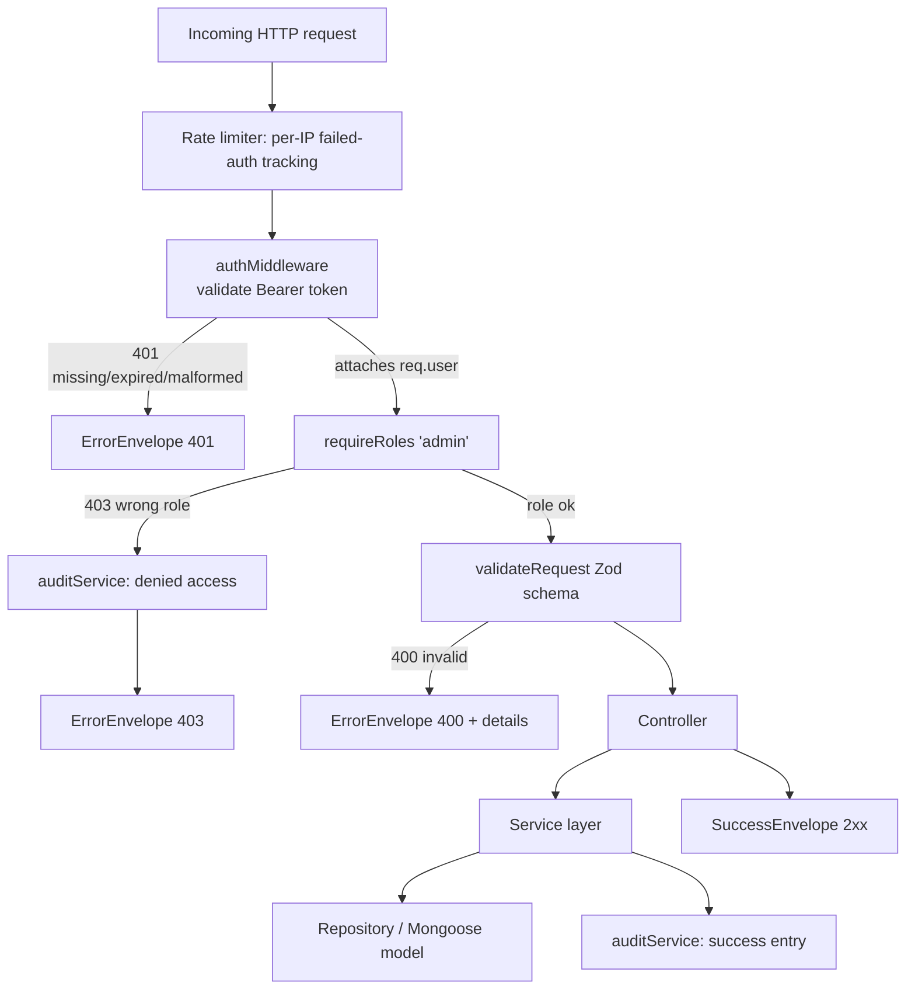
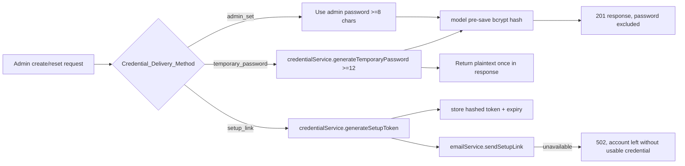

# Design Document

## Overview

This design closes a critical security gap and delivers admin-driven management of student and faculty accounts and their credentials. It is milestone 1 of making the Gurukul AI platform fully functional.

The work divides into two halves:

1. **Security hardening (Requirements 1–3, 11)** — Re-enable the existing but commented-out `authMiddleware` and `requireRoles('admin')` on the student, faculty, course, and enrollment routes so that no privileged data operation is reachable anonymously, and prove via the route map that every admin-management endpoint fails closed.
2. **Admin user & credential management (Requirements 4–10, 12)** — Extend the existing `studentService` / `facultyService` and controllers with full account lifecycle (create, update, soft-delete, reactivate, list/search/filter) plus secure initial-credential delivery (`admin_set`, `temporary_password`, `setup_link`) and admin-initiated password reset.

The design deliberately reuses the building blocks that already exist:

| Existing asset | Role in this feature |
| --- | --- |
| `authMiddleware` (`middleware/authMiddleware.ts`) | Validates the access token, attaches `{ userId, role }` |
| `requireRoles(...)` / `adminOnly` (`middleware/rbacMiddleware.ts`) | Enforces the `admin` role, exposes `__roles` for the route map |
| `validateRequest` (`middleware/validateRequest.ts`) | Zod-based body/query/params validation → 400 with `details[]` |
| `AppError` + `globalErrorHandler` | Standard error envelope (`{ success, message, details? }`) |
| `success` / `failure` (`utils/envelope.ts`) | Canonical response envelope |
| `Student` / `Faculty` models | bcrypt pre-save hashing, `password select:false`, `active`, `deletedAt` |
| `passwordService` | bcrypt hashing/compare, lockout, failed-attempt tracking |
| `authTokenService` | Token issuance + `revokeTokenFamily(userId)` for reset |
| `auditService` + `AuditLog` model | Privileged-action audit trail |
| `buildRouteMap` (`utils/routeMap.ts`) | Static verification that RBAC is wired on every route |

New code is additive: a `credentialService`, an `emailService` abstraction, admin-facing service methods, an `auditContext` helper, and per-endpoint rate limiting. No model is replaced; the `Student`/`Faculty` schemas gain a small number of setup-token fields.

### Scope boundaries

- Course and enrollment endpoints receive **only** authentication + role enforcement; their business behavior is unchanged.
- Excluded: course planning UI, AI features, role-specific dashboards (later milestones).

## Architecture

### Request pipeline for an admin-management endpoint



The middleware order is fixed and enforced for every admin-management endpoint: **rate limiter → `authMiddleware` → `requireRoles('admin')` → `validateRequest` → controller**. This ordering guarantees Requirement 12.6 (a request that is both unauthenticated and unauthorized returns 401, never 403) because `authMiddleware` runs and throws before `requireRoles` is reached.

### Layering

The codebase already follows a strict **routes → controllers → services → repositories → models** layering, and this design preserves it:

- **Routes** declare the middleware chain (auth, RBAC, validation) and Zod schemas.
- **Controllers** translate HTTP ⇄ domain, build the `AuditContext` from the request, and call services. They never contain business rules.
- **Services** hold all business logic and are HTTP-agnostic (`studentService`, `facultyService`, new `credentialService`).
- **Repositories** wrap Mongoose queries.
- **Models** own schema, indexes, and the bcrypt pre-save hook.

### Credential delivery sub-architecture



## Components and Interfaces

### 1. Route hardening (Requirements 1, 2, 3)

`studentRoutes.ts`, `facultyRoutes.ts`, `courseRoutes.ts`, and `enrollmentRoutes.ts` currently have their auth/RBAC imports and usages commented out. The design activates them with this matrix:

| Route | Methods | Auth | Role enforcement |
| --- | --- | --- | --- |
| `/api/students` | GET (list), GET `/:id` | `authMiddleware` | `requireRoles('admin','teacher')` for list/read |
| `/api/students` | POST, PUT `/:id`, DELETE `/:id` | `authMiddleware` | `adminOnly` |
| `/api/faculty` | GET, GET `/:id` | `authMiddleware` | `requireRoles('admin','teacher')` |
| `/api/faculty` | POST, PUT `/:id`, DELETE `/:id` | `authMiddleware` | `adminOnly` |
| `/api/courses`, `/api/enrollment` | all | `authMiddleware` | `requireRoles('admin','teacher')` (read), `adminOnly` (write) — business logic unchanged |
| `/api/students/:id/password-reset`, `/api/faculty/:id/password-reset` | POST (new) | `authMiddleware` | `adminOnly` |
| `/api/students/:id/reactivate`, `/api/faculty/:id/reactivate` | POST (new) | `authMiddleware` | `adminOnly` |
| `/api/account-setup/:token` | POST (new, public) | none | none (token is the credential) |

Each create/update/delete admin-management route uses the `adminOnly` middleware (or `requireRoles('admin')`), which carries the `__roles` property that `buildRouteMap` reads. Imports are switched from the commented placeholders to:

```ts
import { authMiddleware } from '../middleware/authMiddleware.js';
import { adminOnly, requireRoles } from '../middleware/rbacMiddleware.js';
```

> **Note on the existing `authMiddleware` throw style:** `authMiddleware` throws `AppError` synchronously inside an async function. Express 5 propagates rejected promises to the error handler automatically, so no wrapper is needed; the route map test confirms the function is present in the chain.

### 2. Fail-closed route verification (Requirement 3)

A new test suite (`routes/__tests__/adminEndpointSecurity.test.ts`) uses `buildRouteMap(app)` to assert, for every admin-management endpoint, that:

- the resolved `requiredRole` includes `admin` for create/update/delete routes, and
- the middleware stack contains `authMiddleware` (detected by function name / identity).

If a route is missing either middleware, the route map exposes `requiredRole: null` (or a missing auth layer), and the test fails — surfacing the gap before deploy. At runtime, the chain itself fails closed: any route reaching the handler without `req.user` set causes `requireRoles` to throw 401, and absence of `requireRoles` is caught by the static test rather than silently allowing access.

### 3. `credentialService` (new — Requirements 8, 9)

HTTP-agnostic service that owns all secret generation and setup-token lifecycle.

```ts
export type CredentialDeliveryMethod = 'admin_set' | 'temporary_password' | 'setup_link';

export interface CredentialResult {
  /** bcrypt-ready plaintext to assign to the model (model hook hashes it) */
  passwordToPersist?: string;
  /** plaintext temp password to return to caller exactly once; never logged */
  temporaryPasswordForResponse?: string;
  /** raw setup token to embed in the emailed link; only the hash is stored */
  setupTokenRaw?: string;
  setupTokenHash?: string;
  setupTokenExpiresAt?: Date;
}

export interface ICredentialService {
  /** Build credentials for account creation or reset per the chosen method. */
  prepareCredential(
    method: CredentialDeliveryMethod,
    adminProvidedPassword?: string,
  ): CredentialResult;

  /** Generate a >=12 char random password (crypto-strong). */
  generateTemporaryPassword(): string;

  /** Generate { raw, hash, expiresAt(24h) } for a single-use setup link. */
  generateSetupToken(): { raw: string; hash: string; expiresAt: Date };

  /** Hash a raw setup token for comparison (sha256, matching token-hash convention). */
  hashSetupToken(raw: string): string;

  /** Validate an admin-supplied password meets the >=8 char policy. */
  validateAdminPassword(password: string): void; // throws AppError.badRequest on failure
}
```

Implementation notes:
- Temporary passwords use `crypto.randomBytes` mapped to a 12+ character alphabet (uppercase, lowercase, digits, symbol) guaranteeing length ≥ 12.
- Setup tokens use `crypto.randomBytes(32).toString('hex')`; only `sha256(raw)` is persisted (same hashing convention `authTokenService` uses for refresh tokens). Expiry is `now + 24h`.
- The service never writes to logs and never returns both a stored hash and a plaintext for the same secret except the deliberate one-time temp-password return.

### 4. `emailService` abstraction (new — Requirement 8)

The current `passwordService` reaches into a legacy CJS `emailService.js` via dynamic import. This design introduces a typed wrapper so failures are detectable (needed for the 502 path of Requirement 8.4).

```ts
export interface IEmailService {
  /** Resolves on successful send; rejects/returns false when transport unavailable. */
  sendSetupLink(to: string, setupUrl: string, displayName: string): Promise<void>;
  isAvailable(): Promise<boolean>;
}
```

When `sendSetupLink` rejects (transport down), the account-creation/reset service translates it to `AppError(502, 'EMAIL_UNAVAILABLE', ...)` and ensures the account is **not** left with a usable credential — for `setup_link` creation the account is created with a randomly-hashed unknown password and a setup token; if email fails the create is rolled back (or the account is created `active:false` with no resolvable credential and the operation reports 502). The chosen approach: perform the email send **before** committing a usable login path, so a 502 leaves no usable credential.

### 5. Admin service methods (Requirements 4–7, 9, 10)

Extends the existing `StudentService` / `FacultyService`. New/changed methods (Student shown; Faculty symmetric with `employeeId`/`department`):

```ts
interface AdminStudentOps {
  createWithCredentials(input: CreateStudentInput, ctx: AuditContext): Promise<StudentResponse>;
  updateAccount(id: string, patch: UpdateStudentInput, ctx: AuditContext): Promise<StudentResponse>;
  deactivate(id: string, ctx: AuditContext): Promise<void>;       // soft delete
  reactivate(id: string, ctx: AuditContext): Promise<StudentResponse>;
  resetPassword(id: string, method: CredentialDeliveryMethod, ctx: AuditContext): Promise<ResetResult>;
  list(filters: StudentFilters, pagination: Pagination): Promise<PaginatedResult<StudentResponse>>;
}
```

Behavioral rules implemented in the service:
- **Create**: check email + `studentId`/`employeeId` uniqueness → 409; call `credentialService.prepareCredential`; persist (model hook hashes); set `active:true`; for `temporary_password` return plaintext once; for `setup_link` send email first. Faculty creation without admin privileges sets `isAdmin:false`, `role:'faculty'` (model default already enforces this).
- **Update**: 404 if missing; email-uniqueness within same model → 409; reject `role`/`isAdmin` changes from non-admins at the route layer (admin-only routes), and the update schema for non-admin-callable paths omits those fields.
- **Deactivate (soft delete)**: set `active:false`, `deletedAt:now`; idempotent.
- **Reactivate**: set `active:true`, clear `deletedAt`.
- **Reset password**: generate new credential per method; **revoke all refresh tokens** via `authTokenService.revokeTokenFamily(id)`; never return password data except the one-time temp-password.
- **List**: apply search (name/email regex), `active` filter, `grade` (student) / `department` (faculty); reject `grade`+`department` combination → 400; enforce page-size bounds (1–100) → 400 otherwise; return `meta` with total + page.

### 6. Login enforcement of `active` flag (Requirement 7.3, 7.4)

`authController.login` and `findUserByEmail` currently filter only by `deletedAt: null`. The design adds an explicit `active` check: after locating the user, if `active === false` the login is rejected with 401 (`ACCOUNT_INACTIVE`) without revealing account existence beyond the standard invalid-credentials response. Reactivation (`active:true`, `deletedAt` cleared) removes this block while leaving lockout and other conditions intact.

### 7. Audit integration (Requirement 11)

A small `auditContext` helper builds the actor block from the authenticated request:

```ts
export interface AuditContext {
  userId: string; role: string; ip: string; correlationId: string;
}
export function auditContextFrom(req: AuthenticatedRequest): AuditContext;
```

`ip` comes from `req.ip` / `X-Forwarded-For`; `correlationId` from the existing `correlationId` middleware. Services call `auditService.logEvent` after a successful create/update/deactivate/reactivate/password-reset, mapping to `AuditLog` actions. A new RBAC-denial audit hook records 403 denials. The `AuditLog.action` enum is extended to include account lifecycle actions (`account_created`, `account_updated`, `account_deactivated`, `account_reactivated`, `access_denied`) alongside the existing `password_change`. All audit metadata is passed through a redaction guard that strips any `password`, `temporaryPassword`, `setupToken`, or `token` keys.

### 8. Per-endpoint rate limiting (Requirements 1.6, 9.4)

A dedicated `express-rate-limit` instance (stricter than the global `apiLimiter`) is applied to failed authentication on admin-management endpoints and to password-reset endpoints, keyed by source IP, to throttle brute-force and account-enumeration attempts. Failed attempts are logged via `auditService.logFailedAuth`.

## Data Models

### Student / Faculty schema additions

Both `Student` and `Faculty` already have `email` (unique), `password` (`select:false`, bcrypt pre-save), `active`, `deletedAt`, `resetPasswordToken`, `resetPasswordExpire`, `failedLoginAttempts`, `lockedUntil`. This design repurposes/relies on a single-use **setup token** stored hashed. To avoid overloading the password-reset fields used by lockout flows, add explicit setup-token fields:

```ts
// added to both StudentSchema and FacultySchema
setupTokenHash?: string;     // sha256 of the raw setup token; select:false
setupTokenExpiresAt?: Date;  // 24h expiry
setupTokenUsedAt?: Date;     // set when consumed → enforces single use
```

Invariants:
- `active === false` ⟺ account is deactivated; `deletedAt` is set when `active` is false via soft delete and cleared on reactivation.
- A setup token is valid only when `setupTokenHash` matches, `setupTokenExpiresAt > now`, and `setupTokenUsedAt` is unset.
- `password` is never serialized (`select:false` and excluded from all responses).

### AuditLog (existing, action enum extended)

```ts
action: 'login' | 'logout' | 'password_change' | 'role_modification'
      | 'failed_auth' | 'account_locked' | 'admin_override'
      | 'account_created' | 'account_updated'        // new
      | 'account_deactivated' | 'account_reactivated' // new
      | 'access_denied';                              // new
actor: { userId, role, ip }
target: { resource: 'Student' | 'Faculty', resourceId }
timestamp, correlationId, metadata (redacted)
```

### RefreshToken (existing, unchanged)

Reused via `authTokenService.revokeTokenFamily(userId)` to invalidate sessions on password reset (Requirement 9.3).

### Response shapes

```ts
interface StudentResponse {            // password ALWAYS omitted
  _id; firstName; lastName; email; studentId; grade; active; createdAt; deletedAt?;
}
interface FacultyResponse {            // password ALWAYS omitted
  _id; firstName; lastName; email; employeeId; department; title; active; isAdmin; role; createdAt; deletedAt?;
}
interface CreateAccountResult {
  account: StudentResponse | FacultyResponse;
  temporaryPassword?: string;          // present ONLY for temporary_password method
  setupLinkSent?: boolean;             // true for setup_link method
}
interface ResetResult {
  temporaryPassword?: string;          // present ONLY for temporary_password method
  setupLinkSent?: boolean;
}
```

### Validation schemas (Zod)

Creation extends the existing route schemas with `credentialDeliveryMethod` and conditional `password`:

```ts
const credentialDeliverySchema = z.discriminatedUnion('credentialDeliveryMethod', [
  z.object({ credentialDeliveryMethod: z.literal('admin_set'), password: z.string().min(8) }),
  z.object({ credentialDeliveryMethod: z.literal('temporary_password') }),
  z.object({ credentialDeliveryMethod: z.literal('setup_link') }),
]);

const studentListQuerySchema = paginationQuerySchema.extend({
  grade: z.string().optional(),
  department: z.string().optional(), // presence with grade → 400 in handler
  active: z.enum(['true','false']).optional(),
  search: z.string().optional(),
}).strict();
// limit bounds (1..100) enforced by .int().positive().max(100); limit=0 → 400
```

## Correctness Properties

*A property is a characteristic or behavior that should hold true across all valid executions of a system — essentially, a formal statement about what the system should do. Properties serve as the bridge between human-readable specifications and machine-verifiable correctness guarantees.*

The properties below are derived from the acceptance-criteria prework. Redundant criteria have been consolidated (e.g. student/faculty symmetry, create/update/reset password handling, and the auth-vs-authz status family) so that each property carries unique validation value.

### Property 1: Authentication is wired on every admin-management endpoint

*For any* route classified as an Admin_Management_Endpoint in the application route map, the middleware chain SHALL contain `authMiddleware` ahead of the route handler.

**Validates: Requirements 1.1, 3.1**

### Property 2: Admin role enforcement is wired on every create/update/delete endpoint

*For any* create, update, or delete endpoint for a Student_Account or Faculty_Account, the route map SHALL expose a `__roles` set that includes `admin`, positioned after `authMiddleware`.

**Validates: Requirements 2.1, 3.2, 3.3**

### Property 3: Endpoints fail closed when a required middleware is absent

*For any* admin-management route chain from which a required middleware (auth or RBAC) is removed, a request SHALL be denied (no 2xx response reaches the handler) regardless of the remaining chain.

**Validates: Requirements 3.4, 3.5**

### Property 4: Missing or invalid authentication is rejected with 401

*For any* request to an admin-management endpoint that presents no Authorization header or a malformed Authorization header, the System SHALL respond with HTTP 401 and SHALL NOT execute the route handler.

**Validates: Requirements 1.2, 1.4**

### Property 5: Valid tokens attach identity before authorization

*For any* valid access token carrying a `userId` and `role`, `authMiddleware` SHALL attach `{ userId, role }` matching the token claims to the request before any authorization check runs.

**Validates: Requirements 1.5**

### Property 6: Authentication precedence over authorization

*For any* request, the System SHALL respond with HTTP 401 when authentication is missing or invalid (even when the role would also be insufficient), and SHALL respond with HTTP 403 only when authentication succeeds but the authenticated role lacks the required `admin` role.

**Validates: Requirements 2.2, 2.5, 12.5, 12.6**

### Property 7: Non-admins cannot change account records, role, or isAdmin

*For any* authenticated Non_Admin issuing a create, update, or delete on a Student_Account or Faculty_Account — including attempts to set `role` or `isAdmin` — the System SHALL respond with HTTP 403 and the targeted record's persisted fields SHALL remain unchanged.

**Validates: Requirements 2.2, 2.4**

### Property 8: Passwords are always stored hashed and never returned

*For any* account creation, update, or password reset across Student_Accounts and Faculty_Accounts, the persisted password SHALL be a bcrypt hash that verifies against the originating plaintext and never equals the plaintext, and no response body SHALL contain any password field (the deliberate one-time Temporary_Password value in Property 12 excepted).

**Validates: Requirements 4.2, 4.3, 5.2, 5.3, 6.4, 8.1, 9.5**

### Property 9: Valid account creation succeeds with an active account

*For any* valid student or faculty creation request, the System SHALL create the account, respond with HTTP 201, set `active` to true, and (for faculty created without administrative privileges) set `isAdmin` to false and `role` to `faculty`.

**Validates: Requirements 4.1, 4.7, 5.1, 5.8**

### Property 10: Identifier uniqueness is enforced on create and update

*For any* create or update that would cause a duplicate `email`, `studentId`, or `employeeId` within the same account type, the System SHALL respond with HTTP 409 and SHALL NOT create or modify the conflicting record.

**Validates: Requirements 4.4, 4.5, 5.4, 5.5, 6.3, 12.3**

### Property 11: Invalid requests are rejected with 400 and field details

*For any* creation, update, or list request that fails schema validation, the System SHALL respond with HTTP 400, include a `details` array identifying the invalid fields, and SHALL NOT persist any change.

**Validates: Requirements 4.6, 5.6, 6.5, 12.1**

### Property 12: Temporary passwords are long, hashed, and revealed exactly once

*For any* account creation or reset using the `temporary_password` method, the System SHALL generate a Temporary_Password of at least 12 characters, persist only its bcrypt hash, and return the plaintext value exactly once in the response.

**Validates: Requirements 8.2, 9.1**

### Property 13: Setup links are single-use, time-limited, and store only a hash

*For any* account creation or reset using the `setup_link` method, the System SHALL generate a setup token whose expiry is within 24 hours, persist only the token hash (never the raw token), and invoke the Email_Service to send the link.

**Validates: Requirements 8.3, 9.2**

### Property 14: Expired or used setup tokens are rejected without changing the password

*For any* setup token presented after its expiry or after it has already been consumed, the System SHALL respond with HTTP 400 and the account's stored password hash SHALL remain unchanged.

**Validates: Requirements 8.6**

### Property 15: Secrets are redacted from all audit and application logs

*For any* account creation, update, or password reset across all delivery methods, no Audit_Log entry and no captured application log line SHALL contain a plaintext password or a raw setup token.

**Validates: Requirements 8.5, 11.4**

### Property 16: Update of a missing account is a not-found, and delete is a soft-delete

*For any* update, delete, or reset targeting a non-existent account identifier, the System SHALL respond with HTTP 404 and create no record; and *for any* delete of an existing account, the System SHALL set `active` to false, record `deletedAt`, retain the record, and respond with HTTP 200.

**Validates: Requirements 6.2, 7.1, 7.2, 12.2**

### Property 17: Deactivation blocks authentication; reactivation restores it

*For any* account, while `active` is false the System SHALL deny authentication for that account's credential; and deactivating then reactivating an account SHALL clear `deletedAt`, set `active` to true, and remove the deactivation-based authentication block.

**Validates: Requirements 7.3, 7.4**

### Property 18: Password reset revokes all active refresh tokens

*For any* account with active refresh tokens, a successful password reset SHALL revoke every active refresh token for that account so that no existing session can be refreshed.

**Validates: Requirements 9.3**

### Property 19: List results are sound with respect to filters and exclude passwords

*For any* backing data set and any combination of `search`, `active`, `grade` (student) or `department` (faculty) filters, every returned account SHALL satisfy all applied filters (name/email match for search, equal `active`, matching grade/department), and no returned entry SHALL contain a password field.

**Validates: Requirements 10.1, 10.2, 10.3, 10.4**

### Property 20: Pagination is bounded and reports accurate metadata

*For any* dataset of size N and any requested page size n within 1–100, the System SHALL return at most n entries and include `meta` reporting the correct total (N) and current page.

**Validates: Requirements 10.6**

### Property 21: Out-of-range page size and conflicting filters are rejected with 400

*For any* list request whose page size exceeds 100 or equals 0, or that supplies both a `grade` filter and a `department` filter, the System SHALL respond with HTTP 400.

**Validates: Requirements 10.5, 10.7**

### Property 22: Successful privileged actions produce complete audit entries

*For any* successful create, update, deactivate, reactivate, or password-reset action, the System SHALL write an Audit_Log entry recording the admin's `userId`, role, source IP, action, target resource, target resource identifier, timestamp, and correlation ID.

**Validates: Requirements 11.1, 11.2**

### Property 23: Authorization denials are audited

*For any* admin-management request denied with HTTP 403, the System SHALL write an Audit_Log entry recording the denied access attempt.

**Validates: Requirements 11.3**

### Property 24: Error responses conform to the standard envelope

*For any* error outcome, the response body SHALL match the standard error envelope `{ success: false, message }` carrying a human-readable message and a machine-readable error code, and SHALL use HTTP 401 for missing/invalid authentication and 403 for insufficient role.

**Validates: Requirements 12.4, 12.5**

## Error Handling

All errors flow through the existing `AppError` taxonomy and `globalErrorHandler`, producing the canonical `{ success: false, message, details? }` envelope. No new error-shape is introduced.

| Condition | Status | `AppError` factory / code | Notes |
| --- | --- | --- | --- |
| Missing/malformed/expired token | 401 | `AppError.unauthorized` / `UNAUTHORIZED` | Thrown by `authMiddleware`; expired case carries an "expired" message |
| Authenticated but not admin | 403 | `AppError.forbidden` / `FORBIDDEN` | Thrown by `requireRoles`; triggers `access_denied` audit |
| Schema validation failure | 400 | `validateRequest` → `failure(msg, details)` | `details[]` lists `{ field, reason }` |
| Conflicting filters / bad page size | 400 | `AppError.badRequest` | grade+department, limit>100 or =0 |
| Account not found | 404 | `AppError.notFound` | update/delete/reset/read |
| Duplicate email/studentId/employeeId | 409 | `AppError(409,'CONFLICT',…)` | create + update uniqueness |
| Admin password < 8 chars | 400 | `AppError.badRequest` | `admin_set` policy |
| Expired / used setup token | 400 | `AppError.badRequest` | password left unchanged |
| Email_Service unavailable (`setup_link`) | 502 | `AppError(502,'EMAIL_UNAVAILABLE',…)` | no usable credential left on the account |
| bcrypt hashing failure | 500 | `AppError.internal` | account not persisted |
| Unexpected exception | 500 | generic `failure('An internal error occurred')` | no stack/PII leaked (existing handler) |

Security-specific handling:
- **Fail closed:** if any required middleware is absent, the request is denied (route-map test prevents deploy; runtime chain throws 401/403 rather than allowing access).
- **Anti-enumeration:** password reset for a non-existent account logs a failed attempt and is rate limited; the response does not distinguish "not found" in a way that reveals account existence beyond the standard envelope.
- **Secret hygiene:** the audit/log redaction guard strips `password`, `temporaryPassword`, `setupToken`, and `token` keys before any write.

## Testing Strategy

This feature contains substantial pure logic and universal invariants (credential generation bounds, password hashing, soft-delete/reactivate round-trips, filter soundness, middleware ordering, secret redaction), so **property-based testing applies** and is the primary verification mechanism, complemented by example and integration tests.

### Tooling

- **Test runner:** Jest (existing `jest.config.mjs`).
- **Property library:** `fast-check` (already used throughout `backend/tests/property/`). Property tests live in `backend/tests/property/`.
- **Database:** `mongodb-memory-server` for service/model property tests (matching existing `schemaValidation.property.test.ts`, `securityAuditTrail.property.test.ts`).
- **Route map:** `buildRouteMap(app)` from `utils/routeMap.ts` for the security-wiring properties.

### Property tests (one per correctness property)

Each property above is implemented by a **single** property-based test running a **minimum of 100 iterations**, tagged with a comment in the format:

```
// Feature: secure-admin-user-management, Property {n}: {property text}
```

Generators include: valid/invalid student & faculty creation inputs, arbitrary roles from `{student, teacher, parent, admin}`, malformed Authorization headers, valid signed JWTs over random `userId`/`role`, credential delivery methods, datasets of accounts for list/filter/pagination, and setup tokens in fresh/expired/used states. Properties asserting persistence (8, 9, 10, 12–22) use `mongodb-memory-server`; properties asserting wiring (1, 2, 3) use the in-memory route map and mock handlers; properties asserting middleware behavior (4, 5, 6, 7) use mocked `Request`/`Response`/`NextFunction` as in the existing edge tests.

### Example and edge-case tests

These cover acceptance criteria classified as EXAMPLE/EDGE_CASE in the prework, where input variation adds little value:

- **Expired token → 401 with expired code** (1.3): one crafted expired JWT.
- **Admin reaches handler / success status after completion** (2.3): one example per operation.
- **bcrypt hashing failure → 500, not persisted** (5.7): mock `bcrypt` to throw.
- **`setup_link` + email unavailable → 502, no usable credential** (8.4): mock `emailService.sendSetupLink` to reject.

### Integration tests (1–3 examples each)

- **Failed-auth logging + rate limiting** (1.6, 9.4): assert `auditService.logFailedAuth` is invoked on 401 and that repeated failures from one source engage the limiter. Rate-limiting mechanics themselves are provided by `express-rate-limit` (already trusted) and are exercised, not exhaustively property-tested.

### Verification commands

Run the focused property suite once (no watch mode):

```
npm test --prefix backend -- --runInBand tests/property
```

Run the full backend suite:

```
npm test --prefix backend -- --runInBand
```
