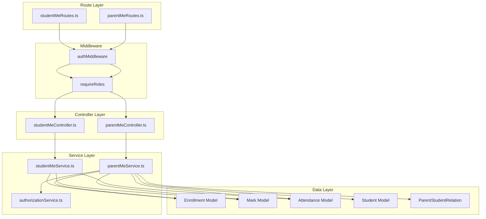
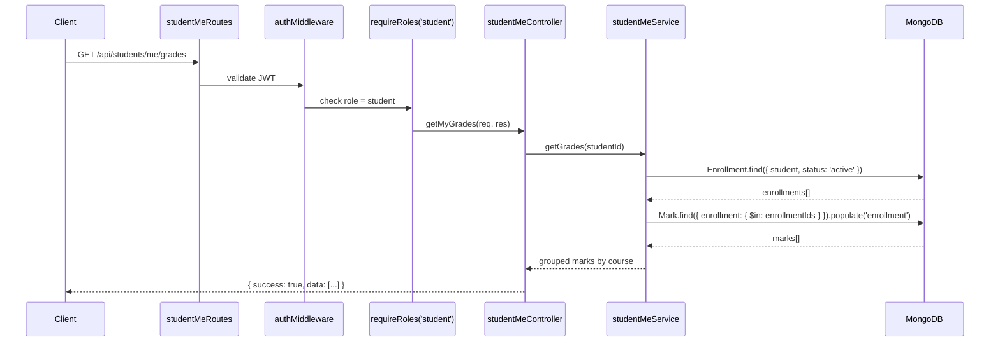
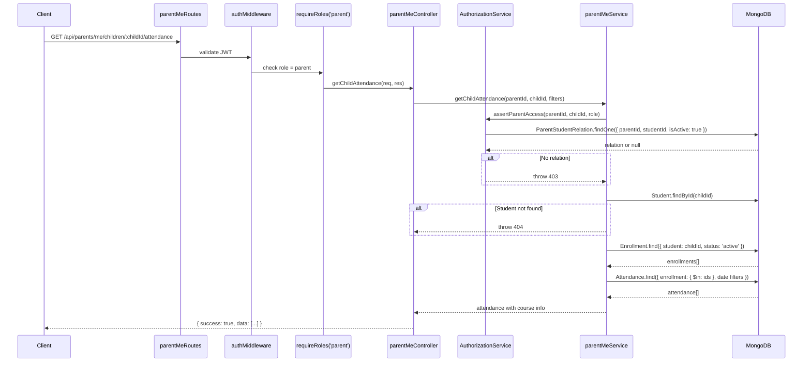

# Design Document: Student & Parent API Routes

## Overview

This feature adds dedicated API routes for student self-service and parent ward-monitoring dashboards. The Student API (`/api/students/me/*`) allows authenticated students to retrieve their own enrollments, grades, and attendance. The Parent API (`/api/parents/me/*`) allows authenticated parents to view their linked children and access each child's courses, grades, and attendance — all gated by the existing `AuthorizationService.assertParentAccess` verification.

Both APIs follow the existing 3-layer architecture (route → controller → service), reuse existing models (Enrollment, Mark, Attendance, Student), and enforce JWT auth + RBAC middleware at the route level.

## Architecture



## Sequence Diagrams

### Student Fetches Their Grades



### Parent Fetches Child's Attendance



## Components and Interfaces

### Component 1: studentMeRoutes.ts

**Purpose**: Define Express routes for student self-service endpoints under `/api/students/me`.

**File path**: `backend/src/routes/studentMeRoutes.ts`

```typescript
// Route definitions
// GET /me/courses       → studentMeController.getMyCourses
// GET /me/grades        → studentMeController.getMyGrades
// GET /me/attendance    → studentMeController.getMyAttendance
```

**Middleware chain**: `authMiddleware` → `requireRoles('student')` → controller

### Component 2: parentMeRoutes.ts

**Purpose**: Define Express routes for parent ward-monitoring endpoints under `/api/parents/me`.

**File path**: `backend/src/routes/parentMeRoutes.ts`

```typescript
// Route definitions
// GET /me/children                          → parentMeController.getMyChildren
// GET /me/children/:childId/courses         → parentMeController.getChildCourses
// GET /me/children/:childId/grades          → parentMeController.getChildGrades
// GET /me/children/:childId/attendance      → parentMeController.getChildAttendance
```

**Middleware chain**: `authMiddleware` → `requireRoles('parent')` → controller

### Component 3: studentMeController.ts

**Purpose**: Handle HTTP request/response for student self-service endpoints.

**File path**: `backend/src/controllers/studentMeController.ts`

```typescript
interface StudentMeController {
  getMyCourses(req: Request, res: Response): Promise<void>;
  getMyGrades(req: Request, res: Response): Promise<void>;
  getMyAttendance(req: Request, res: Response): Promise<void>;
}
```

**Responsibilities**:
- Extract `userId` from `(req as AuthenticatedRequest).user`
- Parse query params (date range filters)
- Delegate to `studentMeService`
- Return consistent `{ success: true, data }` responses

### Component 4: parentMeController.ts

**Purpose**: Handle HTTP request/response for parent ward-monitoring endpoints.

**File path**: `backend/src/controllers/parentMeController.ts`

```typescript
interface ParentMeController {
  getMyChildren(req: Request, res: Response): Promise<void>;
  getChildCourses(req: Request, res: Response): Promise<void>;
  getChildGrades(req: Request, res: Response): Promise<void>;
  getChildAttendance(req: Request, res: Response): Promise<void>;
}
```

**Responsibilities**:
- Extract `userId` (parentId) from `(req as AuthenticatedRequest).user`
- Extract `childId` from `req.params`
- Parse optional query params (date range)
- Delegate to `parentMeService`
- Return consistent `{ success: true, data }` responses

### Component 5: studentMeService.ts

**Purpose**: Business logic for fetching student's own academic data.

**File path**: `backend/src/services/studentMeService.ts`

```typescript
interface StudentMeService {
  getCourses(studentId: string): Promise<EnrollmentWithCourse[]>;
  getGrades(studentId: string): Promise<GradesByCourse[]>;
  getAttendance(studentId: string, dateRange?: DateRange): Promise<AttendanceWithCourse[]>;
}

interface DateRange {
  startDate?: Date;
  endDate?: Date;
}

interface EnrollmentWithCourse {
  enrollmentId: string;
  course: { id: string; name: string; code: string; faculty: string };
  enrollmentDate: Date;
  status: string;
  grade: string;
}

interface GradesByCourse {
  course: { id: string; name: string; code: string };
  marks: {
    id: string;
    title: string;
    type: string;
    score: number;
    maxScore: number;
    percentage: number;
    dueDate?: Date;
    submissionDate?: Date;
    feedback?: string;
  }[];
}

interface AttendanceWithCourse {
  course: { id: string; name: string; code: string };
  date: Date;
  status: string;
  notes?: string;
}
```

### Component 6: parentMeService.ts

**Purpose**: Business logic for parent ward-monitoring, including access verification.

**File path**: `backend/src/services/parentMeService.ts`

```typescript
interface ParentMeService {
  getChildren(parentId: string): Promise<ChildSummary[]>;
  getChildCourses(parentId: string, childId: string, role: UserRole): Promise<EnrollmentWithCourse[]>;
  getChildGrades(parentId: string, childId: string, role: UserRole): Promise<GradesByCourse[]>;
  getChildAttendance(parentId: string, childId: string, role: UserRole, dateRange?: DateRange): Promise<AttendanceWithCourse[]>;
}

interface ChildSummary {
  id: string;
  firstName: string;
  lastName: string;
  studentId: string;
  grade: string;
  active: boolean;
}
```

**Responsibilities**:
- Call `authorizationService.assertParentAccess()` before accessing child data
- Verify child exists (return 404 if not)
- Reuse the same Enrollment → Mark/Attendance query pattern as studentMeService

## Data Models

### Query Pattern: Student → Enrollments → Marks

```typescript
// Step 1: Get student's active enrollments
const enrollments = await Enrollment.find({
  student: studentId,
  status: 'active',
}).populate('course', 'name code faculty');

// Step 2: Get marks for those enrollments
const enrollmentIds = enrollments.map(e => e._id);
const marks = await Mark.find({
  enrollment: { $in: enrollmentIds },
}).populate({
  path: 'enrollment',
  select: 'course',
  populate: { path: 'course', select: 'name code' },
});

// Step 3: Group marks by course
const groupedByCourse = groupMarksByCourse(marks, enrollments);
```

### Query Pattern: Student → Enrollments → Attendance (with date filter)

```typescript
// Build attendance query with optional date range
const query: Record<string, unknown> = {
  enrollment: { $in: enrollmentIds },
};
if (dateRange?.startDate) {
  query.date = { ...query.date, $gte: dateRange.startDate };
}
if (dateRange?.endDate) {
  query.date = { ...query.date, $lte: dateRange.endDate };
}

const attendance = await Attendance.find(query)
  .populate({
    path: 'enrollment',
    select: 'course',
    populate: { path: 'course', select: 'name code' },
  })
  .sort({ date: -1 });
```

### Validation Schemas (Zod)

```typescript
// Date range query params for attendance endpoints
const dateRangeQuerySchema = z.object({
  startDate: z.coerce.date().optional(),
  endDate: z.coerce.date().optional(),
}).strict();

// Child ID param validation
const childIdParamSchema = z.object({
  childId: z.string().min(1, 'Child ID is required'),
}).strict();
```

## Error Handling

### Error Scenario 1: Unauthenticated Request

**Condition**: No valid JWT token in Authorization header
**Response**: HTTP 401 `{ success: false, message: "Authentication required" }`
**Recovery**: Handled by existing `authMiddleware`

### Error Scenario 2: Wrong Role

**Condition**: Authenticated user has a role not permitted for the endpoint
**Response**: HTTP 403 `{ success: false, message: "Role 'X' does not have permission for this resource" }`
**Recovery**: Handled by existing `requireRoles` middleware

### Error Scenario 3: Parent Not Linked to Child

**Condition**: Parent requests data for a student not in their ParentStudentRelation records
**Response**: HTTP 403 `{ success: false, message: "Parents can only access their linked ward's data" }`
**Recovery**: Handled by `authorizationService.assertParentAccess()`

### Error Scenario 4: Child Not Found

**Condition**: The `childId` param does not match any Student document
**Response**: HTTP 404 `{ success: false, message: "Student not found" }`
**Recovery**: Service checks existence before querying data

### Error Scenario 5: Empty Results

**Condition**: No enrollments/marks/attendance found for student
**Response**: HTTP 200 `{ success: true, data: [] }`
**Recovery**: Not an error — return empty array

## Response Format

All endpoints follow this consistent envelope:

```typescript
// Success
{ success: true, data: T }

// Error (via global error handler)
{ success: false, message: string }
```

## Route Mounting in server.ts

```typescript
// New imports in routes/index.ts
export { default as studentMeRoutes } from './studentMeRoutes.js';
export { default as parentMeRoutes } from './parentMeRoutes.js';

// New mount points in server.ts
app.use('/api/students', studentMeRoutes);  // handles /api/students/me/*
app.use('/api/parents', parentMeRoutes);    // handles /api/parents/me/*
```

Note: `studentMeRoutes` is mounted at `/api/students` (same as existing `studentRoutes`). The `/me/*` prefix in the route file avoids collision with existing student CRUD routes.

## Correctness Properties

*A property is a characteristic or behavior that should hold true across all valid executions of a system — essentially, a formal statement about what the system should do. Properties serve as the bridge between human-readable specifications and machine-verifiable correctness guarantees.*

### Property 1: Student data isolation

*For any* authenticated student request, the returned enrollments, marks, and attendance records SHALL belong exclusively to that student — no records from other students are ever included in the response.

**Validates: Requirements 1.1, 2.1, 3.1**

### Property 2: Parent access gate

*For any* parent request to a child endpoint, if no active ParentStudentRelation exists between that parent and the specified child, the system SHALL reject the request with HTTP 403 before any data is queried.

**Validates: Requirements 5.2, 5.3, 6.2, 6.3, 7.2, 7.3**

### Property 3: Empty result consistency

*For any* valid authenticated request where the student has zero matching records (enrollments, marks, or attendance), the API SHALL return HTTP 200 with `{ success: true, data: [] }` rather than an error.

**Validates: Requirements 1.4, 2.5, 3.6, 4.5**

### Property 4: Response envelope consistency

*For any* successful response from Student_API or Parent_API, the response body SHALL contain exactly `{ success: true, data: <result> }` where `data` is the result array or object.

**Validates: Requirements 8.1, 8.2**

### Property 5: Course enrollment filter

*For any* course retrieval request (student or parent), only enrollments with status "active" SHALL be returned — no withdrawn, completed, or failed enrollments appear in course listings.

**Validates: Requirements 1.1, 7.1**

### Property 6: Date range filter correctness

*For any* attendance request with a date range filter, every returned attendance record SHALL have a `date` field within the specified [startDate, endDate] range inclusive.

**Validates: Requirements 3.3, 6.5**
